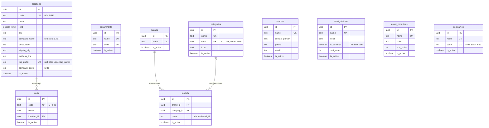
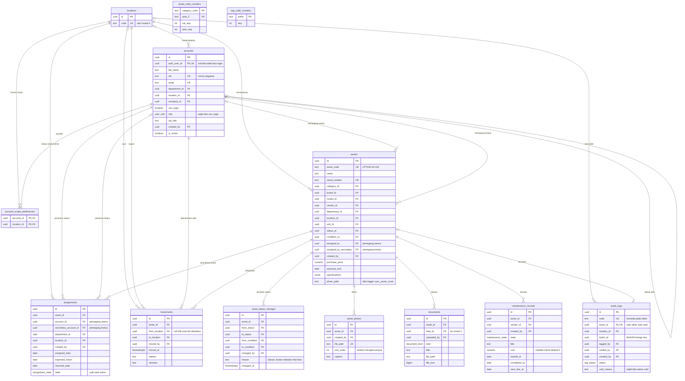
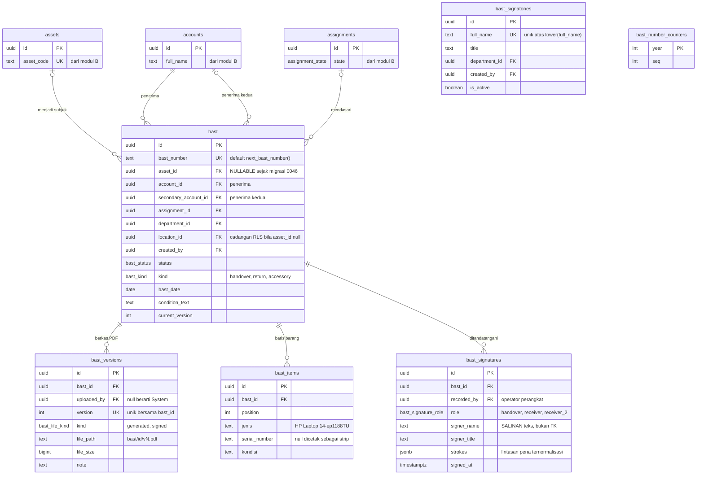
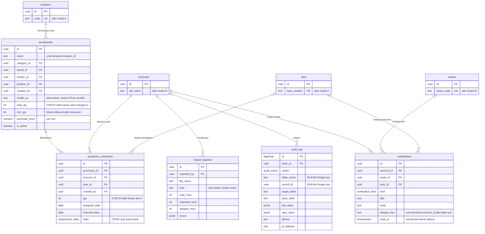
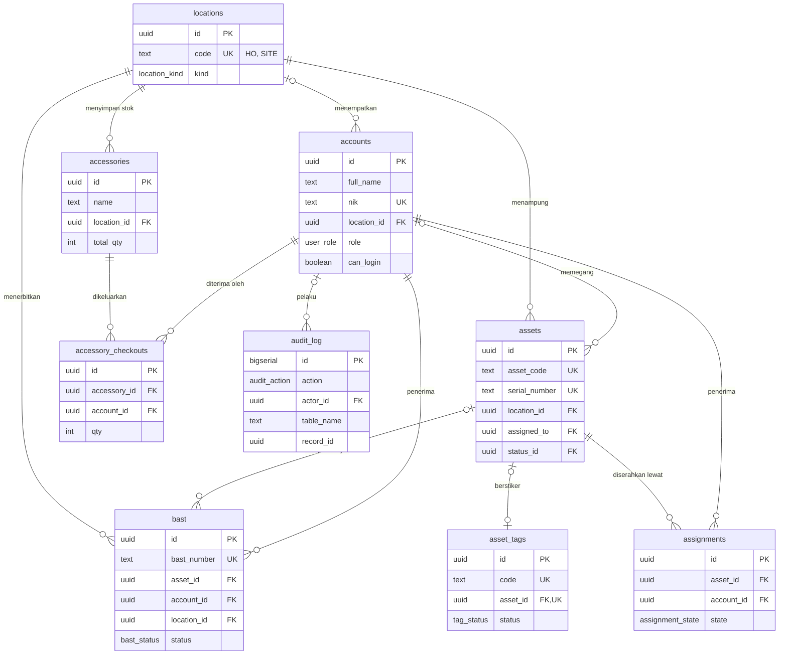

# 03 — Entity Relationship Diagram CITE Assets

Hasil Fase 3. Lima diagram Mermaid (`erDiagram`) yang bersama-sama mencakup
seluruh 33 tabel dan 79 foreign key yang didokumentasikan di
[02-kamus-data.md](02-kamus-data.md).

**Tanggal:** 2026-08-31
**Sumber:** kamus data Fase 2, yang direkonstruksi dari DDL di
`supabase/migrations/` — **bukan** dari katalog sistem PostgreSQL. Batasan itu
diwarisi utuh oleh dokumen ini.

---

## 0. Cara membaca

### 0.1 Notasi kardinalitas

Mermaid memakai simbol di kedua ujung garis. Simbol **kiri** menyatakan berapa
banyak entitas kiri yang dilihat dari satu baris entitas kanan; simbol **kanan**
menyatakan sebaliknya.

| Simbol | Arti |
| --- | --- |
| `\|\|` | tepat satu (kolom FK `NOT NULL`) |
| `\|o` | nol atau satu (kolom FK nullable) |
| `o{` | nol atau lebih |
| `o\|` | nol atau satu, di sisi kanan (kolom FK `UNIQUE` dan nullable) |

Tiga pola yang dipakai di seluruh dokumen ini:

| Pola | Dibaca | Berasal dari |
| --- | --- | --- |
| `A \|\|--o{ B` | satu A punya 0..N B; setiap B wajib punya tepat satu A | FK `NOT NULL` di B |
| `A \|o--o{ B` | satu A punya 0..N B; setiap B punya 0..1 A | FK nullable di B |
| `A \|o--o\| B` | satu A punya paling banyak satu B, dan sebaliknya | FK nullable **dan** `UNIQUE` di B |

Pola ketiga hanya muncul dua kali di seluruh skema (§C dan §B) dan keduanya
sengaja — lihat penjelasan masing-masing.

### 0.2 Yang sengaja tidak digambar

ERD adalah diagram **struktur data**. Tiga hal yang menentukan perilaku sistem
ini tidak muncul di sini dan tidak boleh disimpulkan tidak ada:

1. **Row-Level Security.** Semua kotak `locations` di diagram B, C, dan D adalah
   sumbu tempat RLS bekerja, tetapi policy-nya sendiri tidak punya representasi
   ERD. Contoh: `bast` yang `asset_id`-nya null tetap terlihat/tersembunyi lewat
   `bast.location_id` — aturan itu ada di `can_see_bast_row()`
   (`supabase/migrations/20260821090300_accessory_bast.sql:39-45`), bukan di
   garis relasi.
2. **Trigger.** Dua belas trigger `audit_row()`, sebelas trigger
   `set_updated_at()`, sepuluh trigger `forbid_mutation()`, dan
   `sync_asset_cover()` — semuanya tercatat di Fase 2 §0.4 dan per tabel.
3. **Constraint non-relasional.** CHECK seperti `tag_status_matches_asset` dan
   index parsial seperti `assignments_one_active` menentukan bentuk data
   sekuat foreign key, tetapi bukan relasi antar entitas.

### 0.3 Atribut yang ditampilkan

Sesuai kebutuhan ERD, tiap entitas hanya menampilkan **primary key, seluruh
foreign key, dan atribut penting**. Daftar kolom lengkap ada di
[02-kamus-data.md](02-kamus-data.md). Tipe `numeric(16,2)` ditulis `numeric`
karena tanda kurung mengganggu parser Mermaid.

Penanda: `PK` primary key, `FK` foreign key, `UK` unique.

### 0.4 Ukuran cetak — DIUKUR, dan hasilnya tidak sesuai harapan

Pemecahan menjadi lima diagram **belum cukup** untuk membuat semuanya terbaca di
A4. Ini diukur, bukan diperkirakan: kelima diagram dirender lebih dulu (§F.1),
lalu ukuran teks cetaknya dihitung dari dimensi SVG yang sebenarnya.

Mermaid memakai `font-size: 16px` untuk atribut. Bila sebuah diagram selebar
`W` piksel dicetak selebar `P` milimeter, tinggi hurufnya menjadi
`16 x P / W` mm. Ambang layak baca diambil **8 pt = 2,82 mm**.

| Diagram | Dimensi SVG | Rasio | A4 potret | A4 lanskap | A3 lanskap | Kertas minimum |
| --- | --- | ---: | ---: | ---: | ---: | --- |
| A — Master data | 3509 x 929 | 3,78 | 0,8 mm | 1,2 mm | 1,8 mm | lebih besar dari A2 |
| B — Inti | 4563 x 2542 | 1,79 | 0,6 mm | 0,9 mm | 1,4 mm | lebih besar dari A2 |
| C — E-BAST | 2267 x 1543 | 1,47 | 1,2 mm | 1,8 mm | 2,7 mm | A2 lanskap |
| D — Perlengkapan dan sistem | 2914 x 1415 | 2,06 | 0,9 mm | 1,4 mm | 2,1 mm | A2 lanskap |
| E — Ringkas | 1646 x 1388 | 1,19 | 1,7 mm | 2,0 mm | 2,5 mm | A3 lanskap |

**Kesimpulan yang jujur: tidak satu pun dari kelima diagram ini terbaca bila
dicetak di A4.** Bahkan diagram ringkas (E) baru mencapai ambang 8 pt di A3
lanskap.

#### Mengapa demikian

Penyebabnya adalah cara Mermaid menata `erDiagram`, bukan jumlah atribut. Dua
percobaan yang sudah dijalankan:

| Percobaan | Hasil |
| --- | --- |
| Menambahkan `direction TB` pada diagram A | **Tidak berpengaruh** — dimensi tetap 3509 x 929. Klausa `direction` diabaikan oleh renderer ER |
| Menghapus **seluruh** komentar atribut pada diagram A | 3509 → 2876 px, hanya **18%** lebih sempit. Masih jauh dari cukup |

Pendorong utamanya adalah entitas yang tidak saling terhubung dijejer
**mendatar**. Diagram A punya 10 kotak dengan hanya 3 garis, sehingga tujuh
kotak sisanya berderet ke samping dan menghasilkan rasio 3,78 — tiga kali lebih
lebar dari A4 lanskap.

#### Pilihan yang tersedia

Permintaan "lima diagram" dan permintaan "terbaca di A4" saling bertentangan
pada tata letak ER Mermaid. Tiga jalan keluar, dan pilihan ini milik Anda:

1. **Cetak lebih besar** — C dan D di A2 lanskap, E di A3 lanskap, A dan B
   sebagai lampiran lipat. Struktur A–E tetap seperti sekarang. *Paling murah,
   tidak ada yang perlu diubah.*
2. **Pecah lagi menjadi 9–10 diagram** dengan maksimal 4–5 entitas per diagram
   dan atribut dipangkas hingga PK, FK, dan satu-dua kolom kunci. Ini yang
   benar-benar memenuhi A4, tetapi menyimpang dari struktur lima diagram yang
   diminta.
3. **Terima ukuran sekarang untuk versi digital** — pada PDF layar, pembaca
   dapat memperbesar dan seluruh diagram terbaca sempurna. Banyak skripsi
   memperlakukan ERD sebagai lampiran digital, bukan gambar cetak.

Rekomendasi: **pilihan 1** untuk C, D, dan E; **pilihan 2** khusus untuk A dan B,
karena keduanya yang paling parah (A karena melebar, B karena 13 entitas).

---

## A. ERD Master Data

Sepuluh tabel referensi. Modul ini hampir seluruhnya adalah **tabel datar tanpa
relasi antar sesamanya** — kekayaan relasinya baru muncul ketika modul lain
menunjuk ke sini.



### Penjelasan relasi yang menentukan

**`brands ||--o{ models` adalah satu-satunya relasi wajib di modul ini.**
`models.brand_id` bertipe `not null references brands(id) on delete restrict`
(`20260729090000_init_schema.sql:87`), sehingga sebuah model tidak dapat ada
tanpa merek. Pasangannya, `models.category_id`, justru nullable dengan
`on delete set null` (`:88`) — sebuah model boleh belum dikategorikan. Asimetri
ini menghasilkan constraint unik yang tidak biasa: `unique (brand_id, name)`
(`:93`), bukan `unique (name)`. Artinya "Latitude 5440" boleh ada dua kali di
tabel selama merek­nya berbeda, dan pencarian model **harus** selalu menyertakan
merek agar tidak ambigu.

**Seluruh FK yang masuk ke modul ini memakai `on delete restrict`, dan itu
disengaja.** Komentar di `init_schema:134-136` menyatakan bahwa menghapus
record master yang masih dipakai akan memunculkan error 23503, yang ditangkap
lapisan API menjadi kalimat "Cannot delete … still used by n assets", dengan
saran memakai `is_active = false`. Konsekuensi ERD-nya: **tidak ada satu pun
cascade delete yang berasal dari master data.** Menghapus satu lokasi tidak akan
pernah menghapus aset — ia akan gagal. Tiga pengecualian di seluruh skema
(`accounts.department_id`, `accounts.location_id`, `assets.department_id`)
memakai `set null`, yang melemahkan data tanpa menghapusnya.

**`locations` menanggung dua peran yang sebenarnya berbeda.** Selain menjadi
master data lokasi, sembilan kolom terakhirnya (`company_name` sampai
`company_code`) adalah data **kop surat dan format penomoran**, ditambahkan tiga
migrasi terpisah pada Agustus 2026. Alasannya per lokasi, bukan global, dikutip
dari `20260804140000_bast_documents_and_maintenance_status.sql:155-158`: paragraf
kedua BAST menyebut nama kantor, dan "a BAST raised at Site should not claim
Jakarta". `units` dipisahkan dari `locations` dengan alasan berlawanan —
memasukkan DT-042 ke `locations` akan menaruh dump truck di selector scope dan
di kop surat (`20260820090200_units_and_companies.sql:25-27`).

---

## B. ERD Modul Inti

Aset, orang, penugasan, dan perpindahan. `locations` disertakan sebagai entitas
pinjaman dari modul A karena ia sumbu tempat empat relasi di sini bertumpu;
kolomnya dipangkas.



### Penjelasan relasi yang menentukan

**`assets |o--o| asset_tags` adalah satu-satunya relasi satu-ke-satu di modul
ini, dan seluruh modul label ada untuk menegakkannya.** `asset_tags.asset_id`
bertipe `uuid unique references assets(id) on delete restrict`
(`20260730080000_asset_tags.sql:34`) — nullable karena stiker dicetak kosong
lebih dulu, unique karena satu aset tidak boleh membawa dua stiker. Setengah
aturan lainnya tidak terlihat di ERD: CHECK `tag_status_matches_asset` (`:47-50`)
memaksa `status = 'tagged'` benar **jika dan hanya jika** `asset_id is not null`.
Kedua fakta itu — "berstatus tagged" dan "punya aset" — sengaja dinyatakan dua
kali dan dijaga tetap sama. Alasannya dikutip dari `:19-22`: aset yang salah
label adalah satu-satunya kesalahan yang tidak dapat dideteksi sistem ini setelah
kejadian, karena stiker adalah satu-satunya penghubung fisik kembali ke record.

**`accounts` menunjuk dirinya sendiri, dan itu membuat baris pertama menjadi
kasus khusus.** `accounts.created_by references accounts(id)`
(`init_schema:155`) tanpa `on delete`. Super Admin pertama karenanya harus lahir
dengan `created_by` null — tidak ada akun yang bisa mengklaim telah membuatnya.
Itulah sebabnya ada `scripts/bootstrap-admin.mjs` sebagai jalur terpisah di luar
aplikasi.

**Satu aset, satu assignment aktif, dua nama.** Garis `assets ||--o{ assignments`
terlihat seperti relasi satu-ke-banyak biasa, tetapi index parsial unik
`assignments_one_active on assignments(asset_id) where state = 'active'`
(`init_schema:258`) memangkasnya menjadi **paling banyak satu baris aktif per
aset** — sisanya wajib berstatus `returned`. Ketika kebutuhan dua pemegang
muncul (satu handy-talkie, dua orang shift berlawanan), penambahannya sengaja
**tidak** menyentuh index itu. Dikutip dari
`20260821090500_second_holder.sql:15-17`:

> "`assignments_one_active` stays exactly as it is. There is still one active
> assignment per asset — it just carries two names now."

Karena itu ada dua garis `accounts → assignments` di diagram: `account_id`
(wajib) dan `secondary_account_id` (opsional), dijaga CHECK
`secondary_is_a_different_person` agar keduanya tidak berisi orang yang sama
(`20260821090500:37-38`). Pola yang sama diduplikasi ke `assets` sebagai
`assigned_to` dan `assigned_to_secondary`, murni agar `search_assets()` dapat
menemukan radio itu lewat nama pemegang keduanya (`:29-30`).

**Dua pola penghapusan yang berlawanan bertemu di `assets`.** Enam anak `assets`
memakai `on delete restrict` (`assignments`, `movements`, `asset_status_changes`,
`maintenance_records`, `asset_tags`, dan `bast` di modul C), sedangkan dua
memakai `on delete cascade` (`asset_photos` `20260811090000:34`, `documents`
`init_schema:349`). Pembedanya adalah apakah data itu **kesaksian** atau bukan.
Alasan untuk foto ditulis eksplisit di `20260811090000:24-27`: sebuah foto bukan
catatan peristiwa — tidak ada versi kejadian yang bergantung padanya — sehingga
menyimpan byte yatim selamanya hanya biaya. Perpindahan dan penugasan justru
sebaliknya, dan karenanya menahan penghapusan aset.

**`movements` menyentuh `locations` dua kali dengan kewajiban berbeda.**
`to_location` wajib, `from_location` boleh null untuk aset yang asalnya tidak
diketahui (`init_schema:267-268`), dengan CHECK yang melarang keduanya sama
(`:274`). Kedua garis itu digambar terpisah karena kardinalitasnya memang
berbeda, bukan karena estetika.

**Dua kotak tanpa garis sama sekali.** `asset_code_counters` dan
`tag_code_counters` tidak punya satu pun foreign key, dan itu keputusan
keamanan, bukan kelalaian. Keduanya tidak diberi grant apa pun; satu-satunya
jalan menyentuhnya adalah lewat `next_asset_code()` dan `next_tag_code()` yang
`SECURITY DEFINER` (`20260729120000_grants.sql:25-27`). `category_code` dan
`prefix` menyimpan **teks**, bukan referensi — sehingga menghapus sebuah kategori
tidak akan mengganggu penghitungnya, dan nomor yang sudah diterbitkan tidak
dapat ditarik kembali.

**Satu kotak dengan atribut yang tampak seperti FK tetapi bukan.**
`asset_tags.batch_id` bertipe `uuid` polos tanpa `references`
(`20260730080000:36`). Tidak ada tabel `tag_batches` di skema. Nilai itu
dibangkitkan `create_tag_batch()` untuk menandai satu kali cetak, dan seluruh
metadata batch hanya dapat direkonstruksi dengan mengagregasi baris `asset_tags`.
**Jangan gambarkan batch sebagai entitas di naskah skripsi** — ia bukan entitas.

---

## C. ERD Modul E-BAST

Dokumen serah terima. `assets`, `accounts`, dan `assignments` disertakan sebagai
entitas pinjaman dari modul B dengan kolom dipangkas.



### Penjelasan relasi yang menentukan

**`assets |o--o{ bast` — satu simbol yang berubah, dan seluruh keamanan modul
ikut berubah.** Sampai migrasi 0046, `bast.asset_id` adalah `not null`, sehingga
setiap policy BAST dapat menyelesaikan pertanyaan "boleh dilihat siapa" lewat
asetnya. `20260821090300_accessory_bast.sql:31` melonggarkannya dengan satu
baris — `alter table bast alter column asset_id drop not null` — agar BAST
Perlengkapan yang tidak menyangkut aset mana pun dapat dibuat. Biayanya
disebutkan penulisnya sendiri sebagai baris paling berbahaya di migrasi itu
(`:22-24`):

> "That fallback is the most dangerous line in this migration: get it wrong and
> Site IT can read Head Office's handover notes. `tests/bast-accessory.mjs`
> exists mostly to prove it does not."

Yang menggantikan peran `asset_id` adalah `bast.location_id`, yang `NOT NULL`
sejak awal. Satu fungsi terpusat, `can_see_bast_row(p_asset, p_location)`
(`:39-45`), memutuskan: bila aset null, pakai lokasi; bila tidak, pakai
`can_see_asset()`. **Di ERD, `location_id` terlihat seperti kolom biasa; di
sistem nyata ia adalah jaring pengaman.**

Aturan yang sama terpaksa ditulis dua kali. Policy pada `storage.objects` tidak
dapat membaca baris `bast`, sehingga salinan keduanya adalah
`storage_bast_location_id()`
(`20260824090000_bast_storage_no_asset.sql:31-37`) — dibuat tiga hari kemudian,
setelah ketahuan bahwa BAST Perlengkapan bisa dibuat, dibaca, disunting, dan
ditandatangani, lalu **gagal di langkah terakhir** dengan `AccessDenied 403`
saat PDF-nya diunggah (`:11-17`).

**`bast_signatories` adalah pulau: nol foreign key masuk.** Ini fakta ERD paling
mudah salah gambar di modul ini. Secara intuisi tabel "daftar penanda tangan"
seharusnya menjadi induk `bast_signatures`, tetapi tidak:

```sh
grep -rn "references bast_signatories" supabase/migrations/*.sql
# -> tidak ada hasil
```

`bast_signatures.signer_name` adalah `text not null`
(`20260731090000_ebast_signatures.sql:98`), dan `sign_bast()` mengisinya dari
parameter bebas `trim(p_name)` tanpa pernah menyentuh `bast_signatories`
(`:232-233`). Tabel signatori hanya dibaca `bast_signatories_list()` sebagai
pemasok picker (`:253-257`) dan ditulis `add_bast_signatory()` (`:287`).

Ini **desain yang benar untuk dokumen bukti**, bukan normalisasi yang terlewat.
Karena nama disalin sebagai nilai, mengganti nama seorang signatori atau
menonaktifkannya tidak akan menulis ulang tanda tangan yang sudah ada di
dokumen lama. Sebuah FK justru akan merusak sifat itu. Konsekuensinya untuk
naskah: **jangan menggambar garis antara `bast_signatories` dan
`bast_signatures`**, dan bila diminta menjelaskan, sebutkan bahwa ini
denormalisasi yang disengaja demi keutuhan bukti.

**Tiga anak `bast`, tiga perilaku penghapusan yang berbeda.** Ini pola paling
padat makna di seluruh skema:

| Anak | ON DELETE | Alasan yang terbaca dari kode |
| --- | --- | --- |
| `bast_items` | CASCADE | Baris dokumen, bukan inventaris. Boleh disunting selama draft; yang menahannya setelah ditandatangani adalah penjaga status di RPC, bukan trigger (`20260804140000:224-227`) |
| `bast_versions` | CASCADE | **Tetapi tabelnya append-only lewat trigger** — lihat peringatan di bawah |
| `bast_signatures` | RESTRICT | Tanda tangan adalah bukti; dokumen tidak dapat dihapus selama tanda tangannya ada |

**Peringatan atas `bast_versions`.** Kolom `bast_id` memakai
`on delete cascade` (`init_schema:327`), sementara tabel yang sama memasang
trigger `bast_versions_no_delete` BEFORE DELETE yang memanggil
`forbid_mutation()` (`:341-342`). Kedua aturan itu saling meniadakan: cascade
akan mencoba menghapus, trigger akan menolak. Hasil yang paling mungkin adalah
baris `bast` **tidak dapat dihapus sama sekali** selama ia punya versi. Di ERD
hal ini tampak sebagai relasi cascade biasa, padahal efektifnya bukan.
`[BELUM TERVERIFIKASI — perilaku sesungguhnya saat DELETE dijalankan; perlu
database yang berjalan. Yang dinyatakan di sini adalah pertentangan logis di
DDL, bukan hasil eksekusi.]` Konsisten dengan dugaan itu,
`20260824090300_delete_account_and_void_bast.sql` menambahkan RPC untuk
mem-*void* BAST, bukan menghapusnya.

**`bast_number_counters` berdiri sendiri tanpa garis**, dengan alasan yang sama
seperti dua penghitung di modul B: hak aksesnya dicabut habis dan hanya
`next_bast_number()` yang `SECURITY DEFINER` boleh menyentuhnya. Inilah yang
menjadikan klaim "penomoran BAST server-side sehingga nomor tidak mungkin
bertabrakan" sebagai jaminan struktural, bukan janji aplikasi. Nomor dibangkitkan
sebagai **default kolom** (`bast_number text not null unique default
next_bast_number()`, `init_schema:305`), sehingga bahkan INSERT yang lupa
menyertakan nomor tetap mendapat nomor yang sah.

**Menandatangani tidak membuat dokumen berstatus `signed`.** Relasi
`bast ||--o{ bast_signatures` boleh terisi penuh sementara `bast.status` masih
`draft`. Status berpindah hanya ketika PDF bertanda tangan benar-benar ada, lewat
`attach_signed_bast()` (`20260731090000:37-43`) — sehingga "Signed" tetap punya
satu makna: ada dokumennya. Tidak ada unique constraint pada
`(bast_id, role)`, jadi menandatangani ulang menyisipkan baris baru dan yang
terbaru yang dicetak; percobaan sebelumnya tetap tersimpan (`:29-35`).

---

## D. ERD Modul Perlengkapan dan Sistem

Dua tabel perlengkapan dan tiga tabel sistem. `accounts`, `assets`, `bast`, dan
`locations` disertakan sebagai entitas pinjaman.



### Penjelasan relasi yang menentukan

**`accessories ||--o{ accessory_checkouts` bentuknya kembar dengan
`assets ||--o{ assignments`, tetapi maknanya berlawanan.** Keduanya punya index
parsial `where state = 'active'`, dan di sinilah perbedaannya:

| | `assignments` | `accessory_checkouts` |
| --- | --- | --- |
| Index | `assignments_one_active` | `accessory_checkouts_active_idx` |
| **Unique?** | **YA** (`init_schema:258`) | **TIDAK** (`20260821090200:71-72`) |
| Akibat | satu aset, satu pemegang aktif | satu jenis perlengkapan, banyak pemegang serentak |

Perbedaan satu kata kunci itu yang membedakan barang ber-nomor-seri dari barang
yang dihitung per jumlah. Sebuah laptop hanya bisa ada di satu tangan; sepuluh
mouse dari baris stok yang sama bisa tersebar ke sepuluh orang. Karena itu
`accessory_checkouts` punya kolom `qty` dengan CHECK `> 0` (`:60`) yang tidak
punya padanan di `assignments`.

**Ketersediaan stok tidak disimpan sebagai kolom.** `accessories.total_qty`
adalah jumlah yang dimiliki, bukan jumlah yang tersedia. Sisa di rak dihitung
dengan mengurangkan checkout aktif — satu definisi yang dipakai semua pemanggil
(`20260821090200:113-115`). Konsekuensi ERD: **tidak ada atribut `available_qty`
untuk digambar**, dan naskah tidak boleh menyiratkan ada.

**`accessories.model_no` adalah teks, bukan FK ke `models`.** Dua baris di atas
`brand_id` justru FK sungguhan (`:36`). Perlengkapan meminjam merek dari master
data tetapi tidak meminjam modelnya — kemungkinan karena mouse dan kabel jarang
punya nomor model yang layak dimasukkan master data. `min_qty` ada sebagai kolom
tetapi belum dibaca kode mana pun; komentar di `:27-29` menyatakan peringatan
stok menipis tidak diminta klien, dan kolomnya disiapkan agar penambahannya
kelak menjadi perubahan layar, bukan migrasi.

**`audit_log` punya dua kolom yang tampak seperti relasi tetapi bukan.**
`table_name text` dan `record_id uuid` (`init_schema:414-415`) menunjuk baris di
tabel mana pun, tanpa foreign key — memang tidak mungkin ada, karena tujuannya
polimorfik. Inilah alasan migrasi terakhir
`20260831090000_audit_targets.sql` harus menyelesaikan target di dalam SQL:
entri terhadap `assignments` menyebut sebuah assignment, sedangkan yang ingin
dibuka orang adalah **aset** yang assignment itu bicarakan (`:9-13`). ERD tidak
dapat menggambarkan hubungan itu; ia hidup sebagai `case` di dalam
`audit_list()`.

**Satu-satunya relasi `audit_log` yang nyata adalah `actor_id`**, dan itu pun
nullable dengan NO ACTION. Perhatikan bahwa `audit_log` adalah satu-satunya
tabel dengan primary key `bigserial` di seluruh skema; `authenticated` sengaja
tidak diberi hak pakai sequence-nya, karena baris hanya boleh masuk lewat
trigger `audit_row()` yang `SECURITY DEFINER`
(`20260729120000_grants.sql:75-76`).

**`notifications` punya tiga FK cascade, dan itu satu-satunya tempat cascade
dipakai untuk membersihkan, bukan untuk mengikat.** `account_id`, `asset_id`,
dan `bast_id` semuanya `on delete cascade` (`init_schema:385`, `:389`, `:390`).
Menghapus aset akan menghapus pemberitahuan tentangnya — wajar, karena
pemberitahuan yang menunjuk ke sesuatu yang tidak ada lagi tidak berguna.
Index parsial unik `notifications_dedupe_key on (account_id, dedupe_key) where
dedupe_key is not null` (`20260801090000_phase6.sql:284-286`) itulah yang
mencegah job harian mengirim pesan yang sama dua kali; nullable karena
pemberitahuan hasil tindakan manusia bersifat sekali jalan dan tidak punya lawan
tabrakan (`:279-280`).

---

## E. ERD Ringkas

Delapan entitas utama untuk gambaran umum. Atribut dipangkas hingga identitas
dan kunci saja; tabel penghitung, tabel riwayat, dan tabel pendukung
dihilangkan.



### Penjelasan relasi yang menentukan

**`locations` adalah pusat sesungguhnya sistem ini, bukan `assets`.** Empat dari
delapan entitas utama menunjuk langsung ke sana, dan tiga di antaranya wajib
(`assets`, `accessories`, `bast`). Alasannya bukan pemodelan domain melainkan
keamanan: seluruh Row-Level Security diselesaikan lewat `location_id`, dan
`my_location_ids()` adalah fungsi yang paling banyak dipanggil policy di
repositori ini. Sebuah aset tanpa lokasi akan menjadi aset yang tidak dapat
diputuskan boleh dilihat siapa — karena itu kolomnya `not null`
(`init_schema:189`).

**Ada dua jalur berbeda dari `assets` ke `accounts`, dan keduanya perlu.**
Jalur pertama, `assets.assigned_to`, adalah **keadaan sekarang** — denormalisasi
agar pencarian dan daftar tidak perlu join. Jalur kedua, lewat `assignments`,
adalah **riwayat** — siapa memegang apa, sejak kapan, sampai kapan, dan dengan
catatan apa. Diagram ringkas ini sengaja menampilkan keduanya supaya terlihat
bahwa `assigned_to` bukan sumber kebenaran melainkan cache; sumber kebenarannya
adalah baris `assignments` yang `state = 'active'`, yang keunikannya dijaga
index parsial.

**`bast` menggantung pada dua induk sekaligus, dan salah satunya boleh kosong.**
`account_id` wajib — selalu ada penerima. `asset_id` boleh null sejak migrasi
0046, sehingga sebuah BAST dapat berdiri tanpa aset (kasus BAST Perlengkapan).
Di diagram ringkas, itulah satu-satunya garis `|o--o{` yang berasal dari
`assets`, dan pembaca yang teliti akan bertanya bagaimana dokumen tanpa aset
tetap terjaga keamanannya. Jawabannya `bast.location_id` — yang justru
ditampilkan di kotak `bast` pada diagram ini agar pertanyaan itu terjawab tanpa
membuka modul C.

**`audit_log` tersambung ke seluruh sistem tanpa satu pun foreign key ke
sistem itu.** Satu-satunya garisnya adalah `actor_id` ke `accounts`. Hubungan ke
objek yang diaudit ditanggung `table_name` + `record_id` yang polimorfik.
Diagram ini menampilkannya justru untuk menunjukkan bentuk itu: sebuah tabel
yang mencatat segalanya tetapi secara struktural nyaris terlepas dari
segalanya — sifat yang membuatnya dapat menjadi append-only tanpa menahan
penghapusan apa pun.

**Yang tidak muncul di diagram ringkas dan sebaiknya disebut di narasi:**
`movements` (riwayat perpindahan antar lokasi), `asset_status_changes` (riwayat
disposal beserta alasannya), `bast_signatures` (tanda tangan sebagai lintasan
pena), dan `maintenance_records`. Keempatnya adalah tabel riwayat yang
menggantung pada `assets` atau `bast` dan akan membuat diagram ringkas berhenti
menjadi ringkas.

---

## F. Verifikasi cakupan dan render

### F.1 Kelima diagram sudah dirender, bukan hanya ditulis

Seluruh blok Mermaid di dokumen ini diekstrak dan dijalankan melalui
`@mermaid-js/mermaid-cli` v11 pada 2026-08-31. Kelimanya menghasilkan SVG yang
sah; tidak satu pun berisi grafik "Syntax error".

```sh
# ekstrak tiap blok ```mermaid menjadi berkas .mmd, lalu:
pnpm dlx @mermaid-js/mermaid-cli@11 -i diagramN.mmd -o diagramN.svg

# tidak ada pesan syntax error di keluaran mana pun
grep -ci "syntax error" *.svg          # -> 0 pada kelima berkas
```

Hasil per diagram — "terender" dihitung dengan mencari tiap nama entitas yang
dideklarasikan di berkas `.mmd` sebagai teks di dalam SVG hasilnya:

| Diagram | Kotak entitas | Terender | Garis relasi |
| --- | ---: | ---: | ---: |
| A — Master data | 10 | 10 | 3 |
| B — Inti | 13 | 13 | 21 |
| C — E-BAST | 9 | 9 | 7 |
| D — Perlengkapan dan sistem | 9 | 9 | 9 |
| E — Ringkas | 9 | 9 | 13 |
| **Total** | **50** | **50** | **53** |

Berkas SVG hasil render disimpan di [`erd/`](erd/) dan dapat langsung
disisipkan ke naskah:

| Berkas | Diagram |
| --- | --- |
| `erd/A-master-data.svg` | A |
| `erd/B-inti.svg` | B |
| `erd/C-ebast.svg` | C |
| `erd/D-perlengkapan-sistem.svg` | D |
| `erd/E-ringkas.svg` | E |

SVG dipilih, bukan PNG, karena tidak pecah saat diperbesar untuk cetak.

### F.2 Seluruh 33 tabel tercakup

Angka 50 di tabel atas menghitung **kotak**, bukan tabel. Sebagian tabel sengaja
digambar ulang di modul lain sebagai *entitas pinjaman* — kolomnya dipangkas
hingga PK saja dan diberi keterangan asal modulnya, supaya relasi lintas modul
tetap terlihat tanpa menggandakan detail.

| Diagram | Entitas utama | Entitas pinjaman | Total kotak |
| --- | ---: | --- | ---: |
| A — Master data | 10 | — | 10 |
| B — Inti | 12 | `locations` | 13 |
| C — E-BAST | 6 | `assets`, `accounts`, `assignments` | 9 |
| D — Perlengkapan dan sistem | 5 | `locations`, `accounts`, `assets`, `bast` | 9 |
| **Jumlah entitas utama** | **33** | | |
| E — Ringkas | 0 | seluruhnya pengulangan | 9 |

10 + 12 + 6 + 5 = **33**, cocok dengan jumlah tabel di
[02-kamus-data.md](02-kamus-data.md) §6.1. Diagram E tidak menyumbang entitas
utama karena kesembilan kotaknya sudah muncul di A sampai D.

### F.3 Entitas yang memang tidak punya garis relasi

Tiga tabel penghitung digambar tanpa satu pun garis, dan itu benar:

| Tabel | Diagram | Mengapa tidak punya FK |
| --- | --- | --- |
| `asset_code_counters` | B | Menyimpan kode kategori sebagai teks; seluruh hak akses dicabut |
| `tag_code_counters` | B | Menyimpan prefix sebagai teks; idem |
| `bast_number_counters` | C | Kunci berupa tahun (`int`); idem |

Satu tabel lain punya garis keluar tetapi nol garis masuk:

| Tabel | Diagram | Catatan |
| --- | --- | --- |
| `bast_signatories` | C | Nol FK masuk. Nama disalin sebagai nilai ke `bast_signatures.signer_name` — disengaja, lihat penjelasan modul C |

## G. Catatan untuk naskah skripsi

Empat hal yang paling mudah salah gambar bila ERD disalin ulang dengan tangan:

1. **`asset_tags.batch_id` bukan entitas.** Tidak ada tabel batch. Menggambar
   `tag_batches` akan menciptakan entitas yang tidak ada di database.
2. **Tidak ada garis `bast_signatories → bast_signatures`.** Godaannya besar,
   tetapi FK-nya tidak ada dan ketiadaannya disengaja.
3. **`audit_log` tidak terhubung ke tabel yang diauditnya.** Hanya `actor_id`
   yang berupa FK.
4. **`accessory_checkouts` bukan tiruan `assignments`.** Index parsialnya tidak
   unique, dan itu satu-satunya pembeda struktural antara barang ber-seri dan
   barang berjumlah.

Selain itu, dua pernyataan yang sebaiknya menyertai ERD di naskah karena tidak
terbaca dari gambar:

- **Cascade hanya dipakai di tujuh tempat** — `account_scope_preferences` (dua
  kolom), `asset_photos`, `documents`, `bast_versions`, `bast_items`, dan tiga
  kolom `notifications`. Selebihnya RESTRICT, SET NULL, atau NO ACTION.
  Pembedanya konsisten: data yang merupakan kesaksian menahan penghapusan, data
  yang hanya pelengkap ikut terhapus.
- **Sembilan belas kolom "pelaku"** (`created_by`, `uploaded_by`, `moved_by`,
  `changed_by`, `recorded_by`, `imported_by`, `actor_id`, `tagged_by`,
  `voided_by`) seluruhnya memakai NO ACTION karena tidak satu pun menuliskan
  klausa `on delete`. `[BELUM TERVERIFIKASI — apakah keseragaman itu keputusan
  sadar atau kelalaian berulang; tidak ada komentar di migrasi mana pun yang
  menjelaskannya, berbeda dari FK master data yang alasannya ditulis eksplisit
  di init_schema:134-136.]`

### Cara merender

Berkas ini Markdown dengan blok ```mermaid. Untuk naskah cetak:

- **VS Code** — extension "Markdown Preview Mermaid Support", lalu cetak ke PDF.
- **Mermaid Live Editor** (mermaid.live) — tempel isi satu blok, ekspor SVG atau
  PNG resolusi tinggi. SVG lebih baik untuk cetak karena tidak pecah.
- **GitHub** — merender ```mermaid secara bawaan bila berkas ini dibuka di web.

Kelima blok **sudah diverifikasi dapat dirender** — lihat §F.1. SVG hasilnya
tersedia di [`erd/`](erd/), sehingga menyalin ulang sintaksnya tidak diperlukan
kecuali Anda ingin mengubah isinya.
