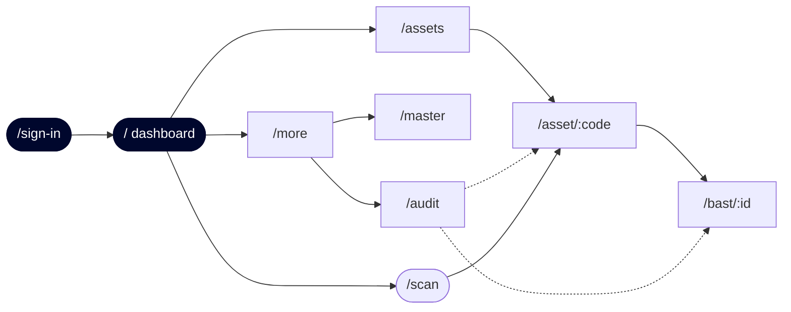
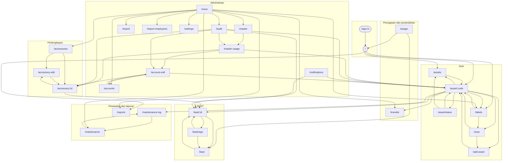

# 06 — Katalog Layar CITE Assets

Hasil Fase 6: seluruh **29 rute** di `app/` beserta dua layout, dan peta
navigasi antar layar.

**Tanggal:** 2026-09-01  
**Revisi:** working tree di atas commit `cd0d9f3`  
**Patokan:** kode di `app/` dan `src/`.

---

## 0. Cara membaca

### 0.1 Rute berasal dari nama berkas

Proyek ini memakai expo-router, sehingga letak berkas **adalah** rutenya.
Segmen `(tabs)` adalah route group — ia tidak muncul di URL. Jadi
`app/(tabs)/assets.tsx` melayani `/assets`, dan `app/(tabs)/asset/[code].tsx`
melayani `/asset/:code`.

```sh
find app -name '*.tsx' -not -name '_layout.tsx' | wc -l    # -> 29
find app -name '_layout.tsx'                               # -> 2
```

### 0.2 Judul

Tidak ada properti `title` pada komponen `Screen`
(`src/components/ui/Screen.tsx:40-52`) dan `_layout.tsx` tidak menyetel judul.
Setiap layar merender judulnya sendiri, hampir seluruhnya lewat
`<Text style={[t.type.screenTitle, ...]}>`. Judul yang berupa ekspresi
ditulis apa adanya karena memang dinamis.

### 0.3 Peran

**Tidak ada route guard otorisasi.** `app/_layout.tsx:75-85` hanya menjaga
*autentikasi* — pengunjung tanpa sesi dialihkan ke `/sign-in`. Sesudah masuk,
setiap rute dapat dicapai peran mana pun; yang membedakan adalah (a) apakah
pintu masuknya ditampilkan, dan (b) apakah kendali di dalamnya dibungkus
`can(...)`. Database adalah penjaga terakhir. Kolom **Peran** karena itu
menyebut siapa yang *dimaksudkan* mengaksesnya, dan kolom di bawahnya
menjelaskan bagaimana itu ditegakkan — atau tidak. Analisis penuhnya ada di
[05-keamanan.md](05-keamanan.md) §5.

### 0.4 Status muat, kosong, dan galat

Aturan penilaian: sebuah layar **wajib** punya status muat dan galat bila ia
mengambil data, dan **wajib** punya status kosong bila ia merender daftar
hasil pengambilan yang bisa kosong. Layar tanpa pengambilan data tidak
dinilai kurang hanya karena tidak punya ketiganya.

Empat layar yang awalnya ditandai kurang oleh pemindaian otomatis sudah
diperiksa satu per satu dan ternyata **tidak ada yang benar-benar kurang** —
ketiganya memakai state manual (`busy`, `setError`) alih-alih idiom
react-query, sehingga regex melewatkannya. Rinciannya di entri masing-masing
dan ringkasannya di §2.

---

## 1. Katalog per rute

### 1. `/sign-in`

- **Berkas:** [app/sign-in.tsx](app/sign-in.tsx) — 169 baris
- **Rute:** `/sign-in`
- **Judul:** `CITE Assets`
- **Peran:** Belum masuk
- **Penegakan:** Satu-satunya rute di luar route guard `app/_layout.tsx:75-85`
- **Komponen utama:** `Button`, `Card`, `Input`
- **Fungsi `src/api/`:** `src/api/session.ts` → `signIn()`
- **Query react-query:** tidak ada
- **Mutation react-query:** tidak ada
- **State lokal:** `email`, `password`, `emailError`, `passwordError`, `formError`, `busy`
- **Status muat / kosong / galat:** manual / N/A / ada — `busy` (`:41`) → `loading={busy}` (`:139`), tiga state galat terpisah. Formulir, bukan daftar
- **Navigasi keluar:** tidak ada

### 2. `/`

- **Berkas:** [app/(tabs)/index.tsx](app/(tabs)/index.tsx) — 384 baris
- **Rute:** `/`
- **Judul:** `greetingFor(account?.fullName)` — sapaan dinamis
- **Peran:** Semua peran
- **Penegakan:** Aksi cepat dibungkus `!isReadOnly` (`index.tsx:171`); kartu Print labels dibungkus `can('asset.create')` (`:104-105`)
- **Komponen utama:** `Bars`, `Button`, `Card`, `Donut`, `EmptyState`, `Screen`, `SkeletonKpiGrid`
- **Fungsi `src/api/`:** `src/api/dashboard.ts` → `fetchDashboard()`
- **Query react-query:** 1

  | Baris | queryKey | queryFn |
  | ---: | --- | --- |
  | 58 | `['dashboard', scope]` | `() => fetchDashboard(scope)` |

- **Mutation react-query:** tidak ada
- **State lokal:** —
- **Status muat / kosong / galat:** ada / ada / ada — `Skeleton` atau `isPending`, `EmptyState`, dan cabang `isError` ketiganya hadir
- **Navigasi keluar:** `/asset/:param`, `/assets`, `/labels`, `/reports`

### 3. `/assets`

- **Berkas:** [app/(tabs)/assets.tsx](app/(tabs)/assets.tsx) — 345 baris
- **Rute:** `/assets`
- **Judul:** `Assets`
- **Peran:** Semua peran
- **Penegakan:** Daftar baca-saja; baris memanggil detail
- **Komponen utama:** `Badge`, `Card`, `CategoryIcon`, `Chip`, `ChipRow`, `EmptyState`, `Input`, `PickerSheet`, `Screen`, `SkeletonRows`
- **Fungsi `src/api/`:** `src/api/assets.ts` → `countAssetsInScope()`, `searchAssets()`; `src/api/masterData.ts` → `listMaster()`
- **Query react-query:** 4

  | Baris | queryKey | queryFn |
  | ---: | --- | --- |
  | 62 | `queryKeys.master('status')` | `() => listMaster('status')` |
  | 67 | `queryKeys.master('category')` | `() => listMaster('category')` |
  | 77 | `[...queryKeys.assets(scope, debounced, status), category, sort]` | `() => searchAssets(scope, { query: debounced, statusId, categoryId: category, sort })` |
  | 83 | `['assetCount', scope]` | `() => countAssetsInScope(scope)` |

- **Mutation react-query:** tidak ada
- **State lokal:** `query`, `status`, `category`, `sort`, `sheet`, `debounced`
- **Status muat / kosong / galat:** ada / ada / ada — `Skeleton` atau `isPending`, `EmptyState`, dan cabang `isError` ketiganya hadir
- **Navigasi keluar:** `/asset/:param`

### 4. `/asset/[code]`

- **Berkas:** [app/(tabs)/asset/[code].tsx](app/(tabs)/asset/[code].tsx) — 1532 baris
- **Rute:** `/asset/[code]`
- **Judul:** `{a.assetCode}` (baris 262) dengan `{a.name}` di bawahnya (263) — dinamis dari data
- **Peran:** Semua peran
- **Penegakan:** Kendali tulis dibungkus `can('asset.edit')`, `can('asset.delete')`, `can('assignment.write')`
- **Komponen utama:** `Avatar`, `Badge`, `BottomSheet`, `Button`, `Card`, `CategoryIcon`, `Chip`, `ChipRow`, `EmptyState`, `Input`, `PickerSheet`, `Screen`, `SelectField`, `Skeleton`
- **Fungsi `src/api/`:** `src/api/assets.ts` → `addAssetPhoto()`, `deleteAsset()`, `fetchAssetDetail()`, `fetchAssetPhotos()`, `removeAssetPhoto()`, `signedPhotoUrl()`; `src/api/documents.ts` → `addDocument()`, `signedDocumentUrl()`, `uploadDocumentFile()`; `src/api/masterData.ts` → `listMaster()`; `src/api/tags.ts` → `attachTag()`, `fetchAssetTagCode()`; `src/api/units.ts` → `installAssetToUnit()`, `removeAssetFromUnit()`
- **Query react-query:** 4

  | Baris | queryKey | queryFn |
  | ---: | --- | --- |
  | 119 | `queryKeys.asset(code ?? '')` | `() => fetchAssetDetail(code ?? '')` |
  | 128 | `['assetTag', detail.data?.asset.id]` | `() => fetchAssetTagCode(detail.data!.asset.id)` |
  | 149 | `queryKeys.master('unit')` | `() => listMaster('unit')` |
  | 689 | `['assetPhotos', a.id]` | `() => fetchAssetPhotos(a.id)` |

- **Mutation react-query:** 7

  | Baris | mutationFn | Meng-invalidate |
  | ---: | --- | --- |
  | 134 | `() => attachTag(labelCode.trim().toUpperCase(), detail.data!.asset.id)` | `['assetTag']`, `['tagStock']`, `['tags']` |
  | 165 | `() => installAssetToUnit(detail.data!.asset.id, unitId!, unitReason)` | — |
  | 177 | `() => removeAssetFromUnit(detail.data!.asset.id, unfitReason)` | — |
  | 192 | `() => deleteAsset(detail.data!.asset.id, deleteReason)` | `['assetCount']`, `['assets']`, `['dashboard']` |
  | 724 | `async (source: 'camera' | 'library') => { const permission = source === 'camera' ? await ImagePicker.requestCameraPermissionsAsync` | — |
  | 763 | `(photoId: string) => removeAssetPhoto(photoId)` | — |
  | 1182 | `async () => { const picked = await DocumentPicker.getDocumentAsync({ copyToCacheDirectory: true, multiple: false, }); if (picked.c` | `queryKeys.asset(detail.asset.assetCode)` |

- **State lokal:** `tab`, `overflowOpen`, `deleteOpen`, `deleteReason`, `deleteError`, `labelOpen`, `labelCode`, `labelError`, `fitOpen`, `unitPickerOpen`, `unitId`, `unitReason`, `unitError`, `unfitOpen`, `unfitReason`, `unfitError`, `urls`, `photoSheet`, `viewerAt`, `page`, `photoSource`, `at`, `openedAt`, `progress`, `kindOpen`, `kind`
- **Status muat / kosong / galat:** ada / ada / ada — `Skeleton` atau `isPending`, `EmptyState`, dan cabang `isError` ketiganya hadir
- **Navigasi keluar:** `/add-asset?edit=:param`, `/asset/status?code=:param`, `/assets`, `/bast/:param`, `/labels`, `/maintenance-log?asset=:param`, `/maintenance-log?id=:param`, `/scan`, `/transfer?asset=:param` · `router.back()`

### 5. `/asset/status`

- **Berkas:** [app/(tabs)/asset/status.tsx](app/(tabs)/asset/status.tsx) — 284 baris
- **Rute:** `/asset/status`
- **Judul:** `Change status`
- **Peran:** Semua peran mencapainya
- **Penegakan:** **Tidak ada pemeriksaan izin di layar.** Dicapai dari detail aset yang tombolnya sudah bergerbang. RPC `change_asset_status()` menolak Viewer
- **Komponen utama:** `Badge`, `Button`, `Card`, `EmptyState`, `Input`, `Screen`, `Skeleton`
- **Fungsi `src/api/`:** `src/api/assets.ts` → `changeAssetStatus()`, `fetchAssetDetail()`, `fetchAssetFormOptions()`
- **Query react-query:** 2

  | Baris | queryKey | queryFn |
  | ---: | --- | --- |
  | 56 | `queryKeys.asset(code)` | `() => fetchAssetDetail(code)` |
  | 61 | `['assetFormOptions']` | `fetchAssetFormOptions` |

- **Mutation react-query:** 1

  | Baris | mutationFn | Meng-invalidate |
  | ---: | --- | --- |
  | 70 | `() => changeAssetStatus(a!.id, statusId!, reason, conditionId)` | `['assets']`, `['dashboard']`, `queryKeys.asset(code)` |

- **State lokal:** `statusId`, `conditionId`, `reason`, `error`
- **Status muat / kosong / galat:** ada / ada / ada — `Skeleton` atau `isPending`, `EmptyState`, dan cabang `isError` ketiganya hadir
- **Navigasi keluar:** `/asset/:param`, `/assets` · `router.back()`

### 6. `/add-asset`

- **Berkas:** [app/(tabs)/add-asset.tsx](app/(tabs)/add-asset.tsx) — 734 baris
- **Rute:** `/add-asset`
- **Judul:** `Add asset` (judul yang terdeteksi otomatis, `Label`, adalah teks lain di layar yang sama)
- **Peran:** Semua peran mencapainya
- **Penegakan:** Dicapai dari FAB (`_layout.tsx:132`, `!isReadOnly`) dan aksi cepat. Di dalamnya hanya `can('asset.editCode')` yang dijaga; RPC `create_asset()` menolak Viewer
- **Komponen utama:** `Button`, `Card`, `DateField`, `EmptyState`, `Input`, `PickerSheet`, `Screen`, `SelectField`, `Skeleton`
- **Fungsi `src/api/`:** `src/api/assets.ts` → `createAsset()`, `fetchAssetCodePrefix()`, `fetchAssetDetail()`, `fetchAssetFormOptions()`, `previewAssetCode()`, `updateAsset()`; `src/api/tags.ts` → `tagAsset()`
- **Query react-query:** 4

  | Baris | queryKey | queryFn |
  | ---: | --- | --- |
  | 77 | `['assetFormOptions']` | `fetchAssetFormOptions` |
  | 82 | `queryKeys.asset(edit ?? '')` | `() => fetchAssetDetail(edit ?? '')` |
  | 127 | `['assetCodePrefix', categoryId, locationId, boughtOn]` | `() => fetchAssetCodePrefix(categoryId, locationId, boughtOn)` |
  | 134 | `['assetCodePreview', categoryId, locationId, boughtOn]` | `() => previewAssetCode(categoryId, locationId, boughtOn)` |

- **Mutation react-query:** 1

  | Baris | mutationFn | Meng-invalidate |
  | ---: | --- | --- |
  | 224 | `(): Promise<{ id?: string; assetCode: string }> => { const input = { name, categoryId: values.category!.id, serialNumber: serial, ` | `['assetCount']`, `['assets']`, `['tags']`, `queryKeys.asset(asset.assetCode)` |

- **State lokal:** `picker`, `values`, `assetCode`, `name`, `serial`, `purchaseDate`, `purchasePrice`, `warrantyStart`, `warrantyEnd`, `notes`, `specs`, `errors`, `formError`, `codeSeq`, `codeTouched`, `prefilledFor`
- **Status muat / kosong / galat:** ada / ada / ada — `Skeleton` atau `isPending`, `EmptyState`, dan cabang `isError` ketiganya hadir
- **Navigasi keluar:** `/asset/:param` · `router.back()`

### 7. `/scan`

- **Berkas:** [app/(tabs)/scan.tsx](app/(tabs)/scan.tsx) — 254 baris
- **Rute:** `/scan`
- **Judul:** `Scan label`
- **Peran:** Semua peran
- **Penegakan:** `can('asset.create')` menentukan apakah hasil pindai boleh didaftarkan
- **Komponen utama:** `Badge`, `Button`, `Card`, `EmptyState`, `Screen`
- **Fungsi `src/api/`:** `src/api/tags.ts` → `scanTag()`
- **Query react-query:** tidak ada
- **Mutation react-query:** tidak ada
- **State lokal:** `result`, `error`, `busy`
- **Status muat / kosong / galat:** manual / ada / manual — `busy` (`:36`) menahan tombol, `error` (`:33`), `EmptyState` (`:72`). Ditangani lewat state manual, bukan idiom react-query
- **Navigasi keluar:** `/add-asset?tag=:param`, `/asset/:param` · `router.back()`

### 8. `/labels`

- **Berkas:** [app/(tabs)/labels.tsx](app/(tabs)/labels.tsx) — 912 baris
- **Rute:** `/labels`
- **Judul:** `Labels`
- **Peran:** Semua peran mencapainya
- **Penegakan:** `can('asset.create')` menjaga kendali cetak di dalam layar
- **Komponen utama:** `Badge`, `BottomSheet`, `Button`, `Card`, `Chip`, `ChipRow`, `EmptyState`, `Input`, `Screen`, `Skeleton`
- **Fungsi `src/api/`:** `src/api/tags.ts` → `createTagBatch()`, `fetchTagDetail()`, `fetchTagPrefixes()`, `fetchTagStock()`, `listTags()`
- **Query react-query:** 4

  | Baris | queryKey | queryFn |
  | ---: | --- | --- |
  | 96 | `['tagStock', scope]` | `() => fetchTagStock(scope)` |
  | 101 | `['tags', filter, scope]` | `() => listTags(filter === 'all' ? undefined : filter, scope)` |
  | 106 | `['tagPrefixes', scope]` | `() => fetchTagPrefixes(scope)` |
  | 567 | `['tagDetail', code]` | `() => fetchTagDetail(code!)` |

- **Mutation react-query:** 2

  | Baris | mutationFn | Meng-invalidate |
  | ---: | --- | --- |
  | 164 | `async () => { const n = Number(count.replace(/[^\d]/g, '')); if (!n) throw new Error('How many labels do you need?'); // Issued in` | `['tagPrefixes']`, `['tagStock']`, `['tags']` |
  | 196 | `async (rows: TagRow[]) => { if (rows.length === 0) throw new Error('Tick the labels you want to re-export'); await share( rows.map` | — |

- **State lokal:** `count`, `tape`, `symbology`, `layout`, `filter`, `search`, `error`, `openCode`, `picked`, `locationId`, `svg`, `width`, `barcode`, `qr`, `width`
- **Status muat / kosong / galat:** ada / ada / ada — `Skeleton` atau `isPending`, `EmptyState`, dan cabang `isError` ketiganya hadir
- **Navigasi keluar:** `/asset/:param`, `/scan` · `router.back()`

### 9. `/assign`

- **Berkas:** [app/(tabs)/assign.tsx](app/(tabs)/assign.tsx) — 978 baris
- **Rute:** `/assign`
- **Judul:** `isReturn ? 'Asset returned' : 'Assign asset'` — tergantung mode
- **Peran:** Semua peran mencapainya
- **Penegakan:** **Tidak ada pemeriksaan izin di layar.** Dicapai lewat FAB dan aksi cepat yang bergerbang. RPC `assign_asset()` menolak Viewer
- **Komponen utama:** `Avatar`, `Button`, `Card`, `CategoryIcon`, `DateField`, `EmptyState`, `Input`, `PickerSheet`, `Screen`, `SelectField`, `Skeleton`, `Switch`
- **Fungsi `src/api/`:** `src/api/accessories.ts` → `assignAccessory()`, `attachAccessoriesToBast()`, `fetchAccessories()`; `src/api/assets.ts` → `fetchAssetFormOptions()`; `src/api/assignments.ts` → `assignAsset()`, `fetchAssignableAssets()`, `fetchAssignableEmployees()`, `returnAsset()`, `setSecondaryHolder()`; `src/api/bast.ts` → `bastIdByNumber()`
- **Query react-query:** 4

  | Baris | queryKey | queryFn |
  | ---: | --- | --- |
  | 112 | `['assignableEmployees', scope]` | `() => fetchAssignableEmployees(scope)` |
  | 118 | `['assignableAssets', scope, isReturn ? 'return' : 'assign']` | `() => fetchAssignableAssets(scope, isReturn ? 'return' : 'assign')` |
  | 124 | `['assetFormOptions']` | `fetchAssetFormOptions` |
  | 182 | `['accessories', scope, 'assignable']` | `() => fetchAccessories(scope)` |

- **Mutation react-query:** 1

  | Baris | mutationFn | Meng-invalidate |
  | ---: | --- | --- |
  | 210 | `async () => { if (isReturn) { const result = await returnAsset({ assetId: asset!.id, date, conditionId: condition!.id, notes: note` | `['accessories']`, `['assets']`, `['assignableAssets']`, `['bast']`, `queryKeys.asset(asset.asset_code)` |

- **State lokal:** `step`, `personQuery`, `assetQuery`, `employee`, `asset`, `date`, `expectedReturn`, `notes`, `autoBast`, `accessoryPicks`, `accessorySheet`, `secondHolderId`, `secondSheet`, `condition`, `conditionOpen`, `stepError`, `dateError`, `done`, `prefilledFor`, `conditionSeeded`
- **Status muat / kosong / galat:** ada / ada / ada — `Skeleton` atau `isPending`, `EmptyState`, dan cabang `isError` ketiganya hadir
- **Navigasi keluar:** `/`, `/bast` · `router.back()`

### 10. `/transfer`

- **Berkas:** [app/(tabs)/transfer.tsx](app/(tabs)/transfer.tsx) — 407 baris
- **Rute:** `/transfer`
- **Judul:** `Transfer Asset`
- **Peran:** Semua peran mencapainya
- **Penegakan:** **Tidak ada pemeriksaan izin di layar, dan pintu masuknya di menu More juga tidak bergerbang** (`more.tsx:60`). Lihat [05-keamanan.md](05-keamanan.md) §5.3
- **Komponen utama:** `Button`, `Card`, `DateField`, `EmptyState`, `Input`, `PickerSheet`, `Screen`, `SelectField`, `Skeleton`
- **Fungsi `src/api/`:** `src/api/assets.ts` → `fetchAssetFormOptions()`, `searchAssets()`; `src/api/assignments.ts` → `fetchMovements()`, `recordMovement()`
- **Query react-query:** 3

  | Baris | queryKey | queryFn |
  | ---: | --- | --- |
  | 62 | `['transferAssets', scope]` | `() => searchAssets(scope)` |
  | 67 | `['assetFormOptions']` | `fetchAssetFormOptions` |
  | 99 | `['movements', scope, assetId ?? 'all']` | `() => fetchMovements(scope, assetId ?? undefined)` |

- **Mutation react-query:** 1

  | Baris | mutationFn | Meng-invalidate |
  | ---: | --- | --- |
  | 105 | `() => recordMovement({ assetId: asset!.id, toLocationId: destination!.id, reason: reason!.name, remarks: remarks || null, at: `${d` | `['assets']`, `['movements']`, `['transferAssets']`, `queryKeys.asset(asset.asset_code)` |

- **State lokal:** `assetId`, `destination`, `date`, `reason`, `remarks`, `picker`, `errors`, `formError`, `prefilledFor`
- **Status muat / kosong / galat:** ada / ada / ada — `Skeleton` atau `isPending`, `EmptyState`, dan cabang `isError` ketiganya hadir
- **Navigasi keluar:** hanya `router.back()`

### 11. `/bast`

- **Berkas:** [app/(tabs)/bast/index.tsx](app/(tabs)/bast/index.tsx) — 198 baris
- **Rute:** `/bast`
- **Judul:** `E-BAST`
- **Peran:** Semua peran
- **Penegakan:** Daftar baca-saja
- **Komponen utama:** `Badge`, `Card`, `Chip`, `ChipRow`, `EmptyState`, `Screen`, `Skeleton`
- **Fungsi `src/api/`:** `src/api/bast.ts` → `fetchBastList()`, `fetchBastStats()`
- **Query react-query:** 2

  | Baris | queryKey | queryFn |
  | ---: | --- | --- |
  | 52 | `[...queryKeys.bast(scope), kind]` | `() => fetchBastList(scope, kind === 'all' ? undefined : kind)` |
  | 57 | `['bastStats', scope]` | `() => fetchBastStats(scope)` |

- **Mutation react-query:** tidak ada
- **State lokal:** `kind`
- **Status muat / kosong / galat:** ada / ada / ada — `Skeleton` atau `isPending`, `EmptyState`, dan cabang `isError` ketiganya hadir
- **Navigasi keluar:** `/bast/:param`

### 12. `/bast/[id]`

- **Berkas:** [app/(tabs)/bast/[id].tsx](app/(tabs)/bast/[id].tsx) — 1188 baris
- **Rute:** `/bast/[id]`
- **Judul:** `{b.bastNumber}` (baris 297) — dinamis dari data
- **Peran:** Semua peran
- **Penegakan:** Kendali dibungkus `can('bast.write')`
- **Komponen utama:** `Badge`, `BottomSheet`, `Button`, `Card`, `Chip`, `ChipRow`, `EmptyState`, `Input`, `Screen`, `Skeleton`
- **Fungsi `src/api/`:** `src/api/bast.ts` → `attachSignedBast()`, `deleteBast()`, `fetchBastDetail()`, `generateBastPdf()`, `setBastItems()`, `setBastKind()`, `signatureCaption()`, `signatureRolesFor()`, `signedBastUrl()`, `uploadSignedScan()`, `voidBast()`
- **Query react-query:** 1

  | Baris | queryKey | queryFn |
  | ---: | --- | --- |
  | 104 | `['bastDetail', id]` | `() => fetchBastDetail(id)` |

- **Mutation react-query:** 6

  | Baris | mutationFn | Meng-invalidate |
  | ---: | --- | --- |
  | 138 | `(kind: BastKind) => setBastKind(id, kind)` | — |
  | 150 | `() => voidBast(id, removeReason)` | — |
  | 161 | `() => deleteBast(id, removeReason)` | — |
  | 182 | `async () => { const result = await generateBastPdf(id); // The function deliberately returns only the path; the signed URL is // m` | — |
  | 197 | `async () => { const picked = await DocumentPicker.getDocumentAsync({ type: ['application/pdf', 'image/jpeg'], copyToCacheDirectory` | — |
  | 833 | `() => setBastItems( bast.id, draft.map((row) => ({ jenis: row.jenis.trim(), serial: row.serial.trim(), kondisi: row.kondisi.trim()` | `['bastDetail', bast.id]` |

- **State lokal:** `progress`, `uploadedName`, `removeOpen`, `removeReason`, `removeError`, `editing`, `draft`, `error`, `width`
- **Status muat / kosong / galat:** ada / ada / ada — `Skeleton` atau `isPending`, `EmptyState`, dan cabang `isError` ketiganya hadir
- **Navigasi keluar:** `/bast`, `/bast/sign?id=:param&role=:param` · `router.back()`

### 13. `/bast/sign`

- **Berkas:** [app/(tabs)/bast/sign.tsx](app/(tabs)/bast/sign.tsx) — 400 baris
- **Rute:** `/bast/sign`
- **Judul:** `signatureCaption(bast.kind, role)` — dinamis
- **Peran:** Semua peran mencapainya
- **Penegakan:** **Tidak ada pemeriksaan izin di layar.** RPC `sign_bast()` menolak Viewer
- **Komponen utama:** `Button`, `Card`, `EmptyState`, `Input`, `PickerSheet`, `SelectField`, `SignaturePad`, `Skeleton`
- **Fungsi `src/api/`:** `src/api/bast.ts` → `addSignatory()`, `fetchBastDetail()`, `fetchSignatories()`, `generateBastPdf()`, `signBast()`, `signatureCaption()`
- **Query react-query:** 2

  | Baris | queryKey | queryFn |
  | ---: | --- | --- |
  | 73 | `['bastDetail', id]` | `() => fetchBastDetail(id)` |
  | 82 | `['bastSignatories']` | `fetchSignatories` |

- **Mutation react-query:** 2

  | Baris | mutationFn | Meng-invalidate |
  | ---: | --- | --- |
  | 109 | `() => addSignatory(newName, newTitle || null)` | — |
  | 130 | `async () => { const { complete } = await signBast(id, role, signerName, signerTitle, strokes); if (!complete) return { complete, f` | `['bast']`, `['bastDetail', id]`, `['bastStats']`, `queryKeys.asset(bast.assetCode)` |

- **State lokal:** `strokes`, `pickerOpen`, `signatoryId`, `adding`, `newName`, `newTitle`, `error`
- **Status muat / kosong / galat:** ada / ada / ada — `Skeleton` atau `isPending`, `EmptyState`, dan cabang `isError` ketiganya hadir
- **Navigasi keluar:** `/bast`, `/bast/:param` · `router.back()`

### 14. `/accessories`

- **Berkas:** [app/(tabs)/accessories.tsx](app/(tabs)/accessories.tsx) — 268 baris
- **Rute:** `/accessories`
- **Judul:** `Accessories`
- **Peran:** Semua peran mencapainya
- **Penegakan:** `can('asset.create')` dipakai sebagai izin pinjaman — perlengkapan tidak punya izin sendiri
- **Komponen utama:** `Button`, `Card`, `CategoryIcon`, `EmptyState`, `Input`, `PickerSheet`, `Screen`, `Skeleton`
- **Fungsi `src/api/`:** `src/api/accessories.ts` → `fetchAccessories()`; `src/api/masterData.ts` → `listMaster()`
- **Query react-query:** 2

  | Baris | queryKey | queryFn |
  | ---: | --- | --- |
  | 49 | `queryKeys.master('category')` | `() => listMaster('category')` |
  | 54 | `['accessories', scope, debounced, category]` | `() => fetchAccessories(scope, { query: debounced, categoryId: category })` |

- **Mutation react-query:** tidak ada
- **State lokal:** `query`, `debounced`, `category`, `sheetOpen`
- **Status muat / kosong / galat:** ada / ada / ada — `Skeleton` atau `isPending`, `EmptyState`, dan cabang `isError` ketiganya hadir
- **Navigasi keluar:** `/accessory-edit`, `/accessory/:param`

### 15. `/accessory/[id]`

- **Berkas:** [app/(tabs)/accessory/[id].tsx](app/(tabs)/accessory/[id].tsx) — 460 baris
- **Rute:** `/accessory/[id]`
- **Judul:** `{a.name}` — dinamis dari data
- **Peran:** Semua peran
- **Penegakan:** `can('asset.edit')` dan `can('assignment.write')`
- **Komponen utama:** `Badge`, `BottomSheet`, `Button`, `Card`, `DateField`, `EmptyState`, `Input`, `PickerSheet`, `Screen`, `SelectField`, `Skeleton`
- **Fungsi `src/api/`:** `src/api/accessories.ts` → `assignAccessory()`, `createAccessoryBast()`, `fetchAccessoryDetail()`, `returnAccessory()`; `src/api/assignments.ts` → `fetchAssignableEmployees()`
- **Query react-query:** 2

  | Baris | queryKey | queryFn |
  | ---: | --- | --- |
  | 75 | `['accessory', id]` | `() => fetchAccessoryDetail(id ?? '')` |
  | 81 | `['assignableEmployees', scope]` | `() => fetchAssignableEmployees(scope)` |

- **Mutation react-query:** 3

  | Baris | mutationFn | Meng-invalidate |
  | ---: | --- | --- |
  | 102 | `() => assignAccessory(id!, accountId!, Number(qty), date, notes || undefined)` | — |
  | 121 | `({ accountId: who, checkoutId }: { accountId: string; checkoutId: string }) => createAccessoryBast(who, [checkoutId])` | `['bast']`, `['bastStats']` |
  | 135 | `(checkoutId: string) => returnAccessory(checkoutId)` | — |

- **State lokal:** `assignOpen`, `peopleOpen`, `accountId`, `qty`, `date`, `notes`, `assignError`, `returning`, `returnError`, `justOut`, `paperError`
- **Status muat / kosong / galat:** ada / ada / ada — `Skeleton` atau `isPending`, `EmptyState`, dan cabang `isError` ketiganya hadir
- **Navigasi keluar:** `/accessory-edit?id=:param`, `/bast/:param` · `router.back()`

### 16. `/accessory-edit`

- **Berkas:** [app/(tabs)/accessory-edit.tsx](app/(tabs)/accessory-edit.tsx) — 366 baris
- **Rute:** `/accessory-edit`
- **Judul:** `editing ? 'Edit accessory' : 'New accessory'`
- **Peran:** Semua peran mencapainya
- **Penegakan:** `can('asset.create')` sebagai izin pinjaman
- **Komponen utama:** `Button`, `Card`, `DateField`, `EmptyState`, `Input`, `PickerSheet`, `Screen`, `SelectField`, `Skeleton`, `Switch`
- **Fungsi `src/api/`:** `src/api/accessories.ts` → `createAccessory()`, `fetchAccessoryDetail()`, `updateAccessory()`; `src/api/masterData.ts` → `listMaster()`
- **Query react-query:** 5

  | Baris | queryKey | queryFn |
  | ---: | --- | --- |
  | 70 | `['accessory', id]` | `() => fetchAccessoryDetail(id!)` |
  | 76 | `queryKeys.master('category')` | `() => listMaster('category')` |
  | 80 | `queryKeys.master('brand')` | `() => listMaster('brand')` |
  | 84 | `queryKeys.master('vendor')` | `() => listMaster('vendor')` |
  | 88 | `queryKeys.master('location')` | `() => listMaster('location')` |

- **Mutation react-query:** 1

  | Baris | mutationFn | Meng-invalidate |
  | ---: | --- | --- |
  | 128 | `async () => { const payload = { name: name.trim(), categoryId: categoryId!, locationId: locationId!, totalQty: Number(totalQty || ` | `['accessories']`, `['accessory']` |

- **State lokal:** `name`, `categoryId`, `brandId`, `vendorId`, `locationId`, `modelNo`, `totalQty`, `purchaseDate`, `purchasePrice`, `notes`, `isActive`, `picker`, `error`, `seeded`
- **Status muat / kosong / galat:** ada / ada / ada — `Skeleton` atau `isPending`, `EmptyState`, dan cabang `isError` ketiganya hadir
- **Navigasi keluar:** `/accessory/:param` · `router.back()`

### 17. `/maintenance`

- **Berkas:** [app/(tabs)/maintenance.tsx](app/(tabs)/maintenance.tsx) — 244 baris
- **Rute:** `/maintenance`
- **Judul:** `Maintenance`
- **Peran:** Semua peran
- **Penegakan:** Layar baca-saja: hanya `fetchMaintenance` dan `fetchMaintenanceStats`
- **Komponen utama:** `Badge`, `Card`, `Chip`, `ChipRow`, `EmptyState`, `Screen`, `Skeleton`
- **Fungsi `src/api/`:** `src/api/maintenance.ts` → `fetchMaintenance()`, `fetchMaintenanceStats()`
- **Query react-query:** 2

  | Baris | queryKey | queryFn |
  | ---: | --- | --- |
  | 47 | `['maintenanceStats', scope]` | `() => fetchMaintenanceStats(scope)` |
  | 53 | `['maintenance', scope, filter]` | `() => fetchMaintenance(scope, filter === 'all' ? undefined : filter === 'ongoing')` |

- **Mutation react-query:** tidak ada
- **State lokal:** `filter`
- **Status muat / kosong / galat:** ada / ada / ada — `Skeleton` atau `isPending`, `EmptyState`, dan cabang `isError` ketiganya hadir
- **Navigasi keluar:** `/maintenance-log?id=:param` · `router.back()`

### 18. `/maintenance-log`

- **Berkas:** [app/(tabs)/maintenance-log.tsx](app/(tabs)/maintenance-log.tsx) — 389 baris
- **Rute:** `/maintenance-log`
- **Judul:** `heading` — dinamis
- **Peran:** Semua peran mencapainya
- **Penegakan:** **Tidak ada pemeriksaan izin di layar.** RPC `log_maintenance()` menolak Viewer
- **Komponen utama:** `Badge`, `Button`, `Card`, `DateField`, `EmptyState`, `Input`, `PickerSheet`, `SelectField`, `Skeleton`, `Switch`
- **Fungsi `src/api/`:** `src/api/assets.ts` → `fetchAssetDetail()`, `fetchAssetFormOptions()`; `src/api/maintenance.ts` → `editMaintenance()`, `fetchMaintenance()`, `logMaintenance()`
- **Query react-query:** 3

  | Baris | queryKey | queryFn |
  | ---: | --- | --- |
  | 77 | `queryKeys.asset(assetCode ?? '')` | `() => fetchAssetDetail(assetCode ?? '')` |
  | 83 | `['maintenance', scope, 'all']` | `() => fetchMaintenance(scope)` |
  | 89 | `['assetFormOptions']` | `fetchAssetFormOptions` |

- **Mutation react-query:** 1

  | Baris | mutationFn | Meng-invalidate |
  | ---: | --- | --- |
  | 127 | `async () => { const amount = cost ? Number(cost.replace(/[^\d.]/g, '')) : null; if (editing) { return editMaintenance(id!, { title` | — |

- **State lokal:** `title`, `detail`, `vendorId`, `internal`, `warranty`, `started`, `completed`, `nextDue`, `cost`, `picker`, `error`, `seeded`
- **Status muat / kosong / galat:** ada / ada / ada — `Skeleton` atau `isPending`, `EmptyState`, dan cabang `isError` ketiganya hadir
- **Navigasi keluar:** `/maintenance` · `router.back()`

### 19. `/reports`

- **Berkas:** [app/(tabs)/reports.tsx](app/(tabs)/reports.tsx) — 482 baris
- **Rute:** `/reports`
- **Judul:** `Reports`
- **Peran:** Semua peran
- **Penegakan:** Ekspor CSV/PDF ke berkas lokal; tidak menulis database
- **Komponen utama:** `Bars`, `Button`, `Card`, `Chip`, `ChipRow`, `DateField`, `Donut`, `EmptyState`, `PickerSheet`, `Screen`, `SelectField`, `Skeleton`
- **Fungsi `src/api/`:** `src/api/assets.ts` → `fetchAssetFormOptions()`; `src/api/reports.ts` → `buildReportCsv()`, `buildReportHtml()`, `fetchReport()`, `fetchReportSummary()`, `fetchValueAnalytics()`
- **Query react-query:** 4

  | Baris | queryKey | queryFn |
  | ---: | --- | --- |
  | 73 | `['assetFormOptions']` | `fetchAssetFormOptions` |
  | 75 | `['valueAnalytics', scope, filters, from, to]` | `() => fetchValueAnalytics(scope, filters, from, to)` |
  | 104 | `['reportSummary', scope]` | `() => fetchReportSummary(scope)` |
  | 116 | `['report', scope, applied]` | `() => fetchReport(scope, applied)` |

- **Mutation react-query:** 2

  | Baris | mutationFn | Meng-invalidate |
  | ---: | --- | --- |
  | 122 | `async () => { const data = rows.data ?? []; if (data.length === 0) throw new Error('Nothing matches these filters'); const file = ` | — |
  | 147 | `async () => { const data = rows.data ?? []; if (data.length === 0) throw new Error('Nothing matches these filters'); if (!summary.` | — |

- **State lokal:** `filters`, `from`, `to`, `picker`, `lens`, `error`
- **Status muat / kosong / galat:** ada / ada / ada — `Skeleton` atau `isPending`, `EmptyState`, dan cabang `isError` ketiganya hadir
- **Navigasi keluar:** hanya `router.back()`

### 20. `/import`

- **Berkas:** [app/(tabs)/import.tsx](app/(tabs)/import.tsx) — 372 baris
- **Rute:** `/import`
- **Judul:** `Import assets`
- **Peran:** Semua peran mencapainya
- **Penegakan:** `can('asset.create')` menjaga tombol impor
- **Komponen utama:** `Badge`, `Button`, `Card`, `EmptyState`, `Screen`, `Skeleton`
- **Fungsi `src/api/`:** `src/api/imports.ts` → `fetchImportHistory()`, `importAssets()`
- **Query react-query:** 1

  | Baris | queryKey | queryFn |
  | ---: | --- | --- |
  | 62 | `['importHistory', 'assets']` | `() => fetchImportHistory('assets')` |

- **Mutation react-query:** 4

  | Baris | mutationFn | Meng-invalidate |
  | ---: | --- | --- |
  | 75 | `async () => { const picked = await DocumentPicker.getDocumentAsync({ type: ['text/csv', 'text/comma-separated-values', 'applicatio` | — |
  | 119 | `() => importAssets(rows!, false, fileName ?? 'import.csv')` | `['assets']`, `['dashboard']`, `['importHistory']` |
  | 135 | `() => share('cite-assets-template.csv', buildImportTemplate(), 'Import template')` | — |
  | 140 | `(errors: RowError[]) => share('cite-assets-import-errors.csv', buildErrorReport(errors), 'Rows that were skipped')` | — |

- **State lokal:** `fileName`, `rows`, `preview`, `warning`, `error`
- **Status muat / kosong / galat:** ada / ada / ada — `Skeleton` atau `isPending`, `EmptyState`, dan cabang `isError` ketiganya hadir
- **Navigasi keluar:** hanya `router.back()`

### 21. `/import-employees`

- **Berkas:** [app/(tabs)/import-employees.tsx](app/(tabs)/import-employees.tsx) — 510 baris
- **Rute:** `/import-employees`
- **Judul:** `Import employees`
- **Peran:** super_admin
- **Penegakan:** Pintu masuknya dibungkus `can('account.manage')` (`more.tsx:92`)
- **Komponen utama:** `BottomSheet`, `Button`, `Card`, `EmptyState`, `Screen`, `Skeleton`
- **Fungsi `src/api/`:** `src/api/imports.ts` → `fetchImportHistory()`, `importAccounts()`
- **Query react-query:** 1

  | Baris | queryKey | queryFn |
  | ---: | --- | --- |
  | 69 | `['importHistory', 'employees']` | `() => fetchImportHistory('employees')` |

- **Mutation react-query:** 4

  | Baris | mutationFn | Meng-invalidate |
  | ---: | --- | --- |
  | 87 | `async () => { const picked = await DocumentPicker.getDocumentAsync({ type: ['text/csv', 'text/comma-separated-values', 'applicatio` | — |
  | 130 | `() => importAccounts(rows!, false, fileName ?? 'employees.csv')` | `['accounts']`, `['importHistory', 'employees']` |
  | 148 | `() => share('cite-employees-template.csv', buildEmployeeTemplate(), 'Employee template')` | — |
  | 154 | `(errors: RowError[]) => share( 'cite-employees-skipped.csv', buildErrorReport(errors, 'nik'), 'Rows that were skipped', )` | — |

- **State lokal:** `fileName`, `rows`, `preview`, `warning`, `error`, `confirming`, `showProblems`
- **Status muat / kosong / galat:** ada / ada / ada — `Skeleton` atau `isPending`, `EmptyState`, dan cabang `isError` ketiganya hadir
- **Navigasi keluar:** hanya `router.back()`

### 22. `/master`

- **Berkas:** [app/(tabs)/master.tsx](app/(tabs)/master.tsx) — 512 baris
- **Rute:** `/master`
- **Judul:** `Master data`
- **Peran:** super_admin, corporate_it
- **Penegakan:** Pintu masuk `can('master.write')` (`more.tsx:102`); hapus dibungkus `can('master.delete')`
- **Komponen utama:** `Badge`, `BottomSheet`, `Button`, `Card`, `Chip`, `ChipRow`, `EmptyState`, `Input`, `PickerSheet`, `Screen`, `SelectField`, `Skeleton`
- **Fungsi `src/api/`:** `src/api/masterData.ts` → `createMaster()`, `deleteMaster()`, `labelFor()`, `listMaster()`, `renameMaster()`, `setMasterActive()`
- **Query react-query:** 3

  | Baris | queryKey | queryFn |
  | ---: | --- | --- |
  | 91 | `queryKeys.master(entity)` | `() => listMaster(entity)` |
  | 96 | `queryKeys.master('brand')` | `() => listMaster('brand')` |
  | 109 | `queryKeys.master('location')` | `() => listMaster('location')` |

- **Mutation react-query:** 3

  | Baris | mutationFn | Meng-invalidate |
  | ---: | --- | --- |
  | 137 | `async () => { if (editingId) { await renameMaster(entity, editingId, draft); return 'updated' as const; } const extra: MasterExtra` | — |
  | 167 | `(record: MasterRecord) => setMasterActive(entity, record.id, !record.isActive)` | — |
  | 180 | `(record: MasterRecord) => deleteMaster(entity, record.id)` | — |

- **State lokal:** `entity`, `draft`, `editingId`, `error`, `code`, `kind`, `brandId`, `locationId`, `picker`, `confirming`
- **Status muat / kosong / galat:** ada / ada / ada — `Skeleton` atau `isPending`, `EmptyState`, dan cabang `isError` ketiganya hadir
- **Navigasi keluar:** `/master-usage?entity=:param&id=:param&name=:param` · `router.back()`

### 23. `/master-usage`

- **Berkas:** [app/(tabs)/master-usage.tsx](app/(tabs)/master-usage.tsx) — 230 baris
- **Rute:** `/master-usage`
- **Judul:** `name ?? 'Where it is used'`
- **Peran:** super_admin, corporate_it
- **Penegakan:** Dicapai dari `/master`
- **Komponen utama:** `Badge`, `Card`, `EmptyState`, `Screen`, `Skeleton`
- **Fungsi `src/api/`:** `src/api/masterData.ts` → `fetchMasterUsage()`, `labelFor()`
- **Query react-query:** 1

  | Baris | queryKey | queryFn |
  | ---: | --- | --- |
  | 38 | `['masterUsage', entity, id]` | `() => fetchMasterUsage(entity, id)` |

- **Mutation react-query:** tidak ada
- **State lokal:** —
- **Status muat / kosong / galat:** ada / ada / ada — `Skeleton` atau `isPending`, `EmptyState`, dan cabang `isError` ketiganya hadir
- **Navigasi keluar:** `/accessory/:param`, `/account-edit?id=:param`, `/asset/:param` · `router.back()`

### 24. `/accounts`

- **Berkas:** [app/(tabs)/accounts.tsx](app/(tabs)/accounts.tsx) — 222 baris
- **Rute:** `/accounts`
- **Judul:** `Accounts`
- **Peran:** super_admin
- **Penegakan:** Pintu masuk `can('account.manage')` (`more.tsx:112`); di dalamnya juga `can('account.manage')`
- **Komponen utama:** `Avatar`, `Badge`, `Button`, `Card`, `EmptyState`, `Input`, `Screen`, `Skeleton`
- **Fungsi `src/api/`:** `src/api/accounts.ts` → `fetchAccounts()`
- **Query react-query:** 1

  | Baris | queryKey | queryFn |
  | ---: | --- | --- |
  | 32 | `['accounts', search]` | `() => fetchAccounts(search)` |

- **Mutation react-query:** tidak ada
- **State lokal:** `search`
- **Status muat / kosong / galat:** ada / ada / ada — `Skeleton` atau `isPending`, `EmptyState`, dan cabang `isError` ketiganya hadir
- **Navigasi keluar:** `/account-edit`, `/account-edit?id=:param` · `router.back()`

### 25. `/account-edit`

- **Berkas:** [app/(tabs)/account-edit.tsx](app/(tabs)/account-edit.tsx) — 711 baris
- **Rute:** `/account-edit`
- **Judul:** `editing ? 'Edit person' : 'New person'`
- **Peran:** super_admin mencapainya
- **Penegakan:** **Tidak ada pemeriksaan izin di layar.** Dicapai dari `/accounts` yang sudah bergerbang. RPC menolak non-Super-Admin lewat `assert_can_manage_accounts()`
- **Komponen utama:** `Badge`, `BottomSheet`, `Button`, `Card`, `EmptyState`, `Input`, `PickerSheet`, `SelectField`, `Skeleton`
- **Fungsi `src/api/`:** `src/api/accounts.ts` → `createAccount()`, `deleteAccount()`, `fetchAccountHoldings()`, `fetchAccounts()`, `manageCredentials()`, `updateAccount()`; `src/api/assets.ts` → `fetchAssetFormOptions()`; `src/api/masterData.ts` → `listMaster()`
- **Query react-query:** 4

  | Baris | queryKey | queryFn |
  | ---: | --- | --- |
  | 75 | `['accounts', '']` | `() => fetchAccounts()` |
  | 76 | `['assetFormOptions']` | `fetchAssetFormOptions` |
  | 94 | `queryKeys.master('company')` | `() => listMaster('company')` |
  | 99 | `['accountHoldings', id]` | `() => fetchAccountHoldings(id!)` |

- **Mutation react-query:** 3

  | Baris | mutationFn | Meng-invalidate |
  | ---: | --- | --- |
  | 81 | `() => deleteAccount(id!, removeReason)` | `['accounts']` |
  | 150 | `async () => { const input = { fullName: form!.fullName, nik: form!.nik || null, jobTitle: form!.jobTitle || null, email: form!.ema` | — |
  | 174 | `(action: 'enable' | 'disable' | 'reset') => manageCredentials(id!, action, action === 'disable' ? undefined : password)` | — |

- **State lokal:** `form`, `removeOpen`, `removeReason`, `removeError`, `picker`, `password`, `error`
- **Status muat / kosong / galat:** ada / ada / ada — `Skeleton` atau `isPending`, `EmptyState`, dan cabang `isError` ketiganya hadir
- **Navigasi keluar:** `/accessory/:param`, `/accounts`, `/asset/:param` · `router.back()`

### 26. `/audit`

- **Berkas:** [app/(tabs)/audit.tsx](app/(tabs)/audit.tsx) — 320 baris
- **Rute:** `/audit`
- **Judul:** `Audit log`
- **Peran:** super_admin, corporate_it
- **Penegakan:** Pintu masuk `can('audit.view')` (`more.tsx:122`); RPC `audit_list()` mengulang pemeriksaan
- **Komponen utama:** `Avatar`, `Card`, `Chip`, `ChipRow`, `EmptyState`, `Input`, `Screen`, `Skeleton`
- **Fungsi `src/api/`:** `src/api/audit.ts` → `auditTargetHref()`, `fetchAuditLog()`, `fetchAuditStats()`
- **Query react-query:** 2

  | Baris | queryKey | queryFn |
  | ---: | --- | --- |
  | 45 | `['auditStats']` | `fetchAuditStats` |
  | 51 | `['audit', filter, search, page]` | `() => fetchAuditLog({ action: filter === 'all' ? null : filter, search, offset: page * AUDIT_PAGE_SIZE, })` |

- **Mutation react-query:** tidak ada
- **State lokal:** `filter`, `search`, `page`
- **Status muat / kosong / galat:** ada / ada / ada — `Skeleton` atau `isPending`, `EmptyState`, dan cabang `isError` ketiganya hadir
- **Navigasi keluar:** hanya `router.back()`

### 27. `/notifications`

- **Berkas:** [app/(tabs)/notifications.tsx](app/(tabs)/notifications.tsx) — 262 baris
- **Rute:** `/notifications`
- **Judul:** `Notifications`
- **Peran:** Semua peran
- **Penegakan:** Kotak masuk sendiri; RLS `notif_own` membatasi baris
- **Komponen utama:** `Button`, `Card`, `EmptyState`, `Screen`, `Skeleton`
- **Fungsi `src/api/`:** `src/api/notifications.ts` → `fetchNotifications()`, `isBackupReminder()`, `markAllNotificationsRead()`, `markNotificationRead()`
- **Query react-query:** 1

  | Baris | queryKey | queryFn |
  | ---: | --- | --- |
  | 55 | `['notifications']` | `() => fetchNotifications()` |

- **Mutation react-query:** 2

  | Baris | mutationFn | Meng-invalidate |
  | ---: | --- | --- |
  | 62 | `markNotificationRead` | — |
  | 67 | `markAllNotificationsRead` | — |

- **State lokal:** —
- **Status muat / kosong / galat:** ada / ada / ada — `Skeleton` atau `isPending`, `EmptyState`, dan cabang `isError` ketiganya hadir
- **Navigasi keluar:** `/asset/:param`, `/bast/:param` · `router.back()`

### 28. `/settings`

- **Berkas:** [app/(tabs)/settings.tsx](app/(tabs)/settings.tsx) — 327 baris
- **Rute:** `/settings`
- **Judul:** `Settings`
- **Peran:** Semua peran
- **Penegakan:** `can('account.manage')` menjaga blok job terjadwal
- **Komponen utama:** `Avatar`, `Badge`, `Button`, `Card`, `Input`, `Screen`, `Skeleton`, `Switch`
- **Fungsi `src/api/`:** `src/api/notifications.ts` → `fetchScheduledJobs()`, `runNotificationJobsNow()`; `src/api/session.ts` → `changeOwnPassword()`, `signOut()`
- **Query react-query:** 1

  | Baris | queryKey | queryFn |
  | ---: | --- | --- |
  | 235 | `['scheduledJobs']` | `fetchScheduledJobs` |

- **Mutation react-query:** 2

  | Baris | mutationFn | Meng-invalidate |
  | ---: | --- | --- |
  | 168 | `() => changeOwnPassword(next)` | — |
  | 237 | `runNotificationJobsNow` | — |

- **State lokal:** `next`, `confirm`, `error`
- **Status muat / kosong / galat:** ada / N/A / ada — `jobs.isPending` → `Skeleton` (`:254-255`), `change.isPending` → `loading` (`:220`), `error` (`:166`). Daftar job terjadwal berjumlah tetap sehingga status kosong tidak berlaku
- **Navigasi keluar:** hanya `router.back()`

### 29. `/more`

- **Berkas:** [app/(tabs)/more.tsx](app/(tabs)/more.tsx) — 162 baris
- **Rute:** `/more`
- **Judul:** `More`
- **Peran:** Semua peran
- **Penegakan:** Empat entri terakhir bergerbang; enam pertama tidak
- **Komponen utama:** `ListCard`, `ListRow`, `Screen`
- **Fungsi `src/api/`:** —
- **Query react-query:** tidak ada
- **Mutation react-query:** tidak ada
- **State lokal:** —
- **Status muat / kosong / galat:** N/A / N/A / N/A — Menu statis: nol `useQuery`, nol `useMutation`, hanya memetakan array lokal. Ketiga status tidak berlaku
- **Navigasi keluar:** `/settings`

---

## 2. Dua layout

### `app/(tabs)/_layout.tsx`

- 145 baris
- **Komponen:** `AppHeader`, `BottomNav`, `NavKey`, `OfflineBanner`, `QuickAction`, `QuickActionSheet`, `ScopeDropdown`
- **Query:** 1
  - baris 84: `['notificationsUnread']` → `fetchUnreadCount`

### `app/_layout.tsx`

- 89 baris
- **Komponen:** `ToastHost`

`app/_layout.tsx` memasang provider berurutan — SafeArea → Theme → Query →
Session → navigator — dengan toast host di atas segalanya, dan memegang route
guard autentikasi di `:75-85`. `app/(tabs)/_layout.tsx` merender chrome
aplikasi secara manual (header, scope dropdown, bottom nav mengambang, FAB)
alih-alih memakai komponen `Tabs` bawaan expo-router, supaya nav dapat
mengambang di atas konten dengan celah FAB yang diminta desain.

---

## 3. Peta navigasi

### 3.1 Cara peta ini dibangun

Tepi diambil dari pemanggilan `router.push()` dan `router.replace()` di
setiap berkas. Dua sumber tidak terbaca pemindaian otomatis karena targetnya
berupa variabel, dan keduanya ditambahkan setelah dibaca langsung:

| Layar | Bentuk | Baris |
| --- | --- | --- |
| `/more` | `router.push(m.route)` — target datang dari array menu | `app/(tabs)/more.tsx:145` |
| `/audit` | `router.push(href)` dengan `href = auditTargetHref(entry)` | `app/(tabs)/audit.tsx:225`, `:279` |

Yang kedua layak dicatat tersendiri. Migrasi `20260831090000_audit_targets.sql`
— yang belum di-commit — menambahkan `target_kind`, `target_ref`, dan
`target_extra` ke `audit_list()` dengan alasan yang ditulis di headernya:
*"An audit trail you cannot follow is a list, not a trail."* Sisi klien sudah
lengkap: `auditTargetHref()` (`src/api/audit.ts:94-108`) memetakan tiap jenis
target ke rutenya, dan `audit.tsx:275` membiarkan baris tanpa target tetap
datar alih-alih berpura-pura menjadi tautan. **Kedua paruh fitur itu sudah
tersambung** — bukan setengah jadi seperti yang sempat saya duga.

`router.back()` tidak digambar sebagai tepi; ia ada di 20 layar dan akan
membuat peta tidak terbaca.

### 3.2 Peta ringkas — tujuh simpul utama

Untuk gambaran umum di bab awal.



Garis putus-putus menandai lompatan dari jejak audit ke objek yang diaudit —
tepi yang baru ada sejak migrasi `20260831090000`.

### 3.3 Peta lengkap

Dua puluh sembilan simpul dan 61 tepi. Subgraph mengelompokkan layar menurut modul; tepi
lintas modul digambar di luar subgraph.



### 3.4 Tepi yang tidak berasal dari layar

Tiga jalur masuk digambar di atas seolah datang dari sebuah layar, padahal
berasal dari chrome atau dari guard:

| Tepi | Sumber sesungguhnya |
| --- | --- |
| `/sign-in → /` dan sebaliknya | Route guard autentikasi, `app/_layout.tsx:75-85` |
| chrome → `/notifications` dan `/more` | Ikon lonceng dan avatar di `AppHeader`, dipasang `app/(tabs)/_layout.tsx` |
| FAB → `/add-asset`, `/assign`, `/transfer`, `/bast`, `/scan` | Quick-action sheet, `app/(tabs)/_layout.tsx:99-104`; FAB disembunyikan bila `isReadOnly` (`:132`) |

Jalur FAB itulah yang membuat `/assign` dan `/transfer` dapat dicapai tanpa
melewati satu layar pun — dan untuk `/transfer`, tanpa satu pemeriksaan izin
pun di sepanjang jalannya bila ditempuh lewat menu More. Lihat
[05-keamanan.md](05-keamanan.md) §5.3.

### 3.5 Simpul buntu

Lima layar tidak menavigasi ke mana pun kecuali `router.back()`:
`/transfer`, `/reports`, `/import`, `/import-employees`, dan `/settings`.
Keempat yang pertama adalah formulir atau ekspor sekali jalan; `/settings`
adalah daftar preferensi. Tidak ada yang salah dengan ini — dicatat hanya
supaya peta di atas tidak terbaca seolah bocor.

---

## 4. Verifikasi dan ringkasan

### 4.1 Kedua peta sudah dirender

Seperti pada [03-erd.md](03-erd.md), kedua blok Mermaid diekstrak dan
dijalankan melalui `@mermaid-js/mermaid-cli` v11 sebelum dokumen ini
diserahkan. Keduanya menghasilkan SVG yang sah, nol `syntax error`.

```sh
pnpm dlx @mermaid-js/mermaid-cli@11 -i nav1.mmd -o nav1.svg
grep -ci "syntax error" nav1.svg nav2.svg      # -> 0 pada keduanya
```

Berkas hasilnya di [`nav/`](nav/): `A-peta-ringkas.svg` dan
`B-peta-lengkap.svg`.

### 4.2 Ukuran cetak — diukur, dan kali ini ada kabar baik

Font Mermaid 16px. Tinggi huruf cetak = `16 × lebar_mm / lebar_px`; ambang
layak baca 8 pt = 2,82 mm.

| Peta | Dimensi SVG | Rasio | A4 potret | A4 lanskap | A3 lanskap | A2 lanskap |
| --- | --- | ---: | ---: | ---: | ---: | ---: |
| A — ringkas | 960 × 367 | 2,62 | **2,8 mm** | **4,3 mm** | 6,5 mm | 9,2 mm |
| B — lengkap | 3326 × 1048 | 3,17 | 0,8 mm | 1,2 mm | 1,9 mm | 2,7 mm |

**Peta ringkas muat A4** — 4,3 mm di lanskap adalah sekitar 12 pt, nyaman
dibaca, dan bahkan A4 potret pas di ambang. Ini berbeda dari kelima ERD di
Fase 3 yang tidak satu pun lolos; penyebabnya sederhana, peta ringkas hanya
punya 9 simpul.

**Peta lengkap tidak muat, bahkan di A2** (2,7 mm masih di bawah ambang).
Saran yang sama seperti Fase 3: pakai peta ringkas di badan naskah, dan
letakkan peta lengkap sebagai lampiran digital atau lipat. Memecahnya per
modul akan membuatnya muat, tetapi menghilangkan justru yang membuatnya
berguna — tepi lintas modul.

### 4.3 Angka yang diverifikasi

| Besaran | Jumlah | Perintah |
| --- | ---: | --- |
| Rute | 29 | `find app -name '*.tsx' -not -name '_layout.tsx' \| wc -l` |
| Layout | 2 | `find app -name '_layout.tsx'` |
| Pemanggilan `useQuery` di layar | 64 | `grep -rho 'useQuery(' app/ \| wc -l` → 65, satu di antaranya di `(tabs)/_layout.tsx` |
| Pemanggilan `useMutation` di layar | 46 | `grep -rho 'useMutation(' app/ \| wc -l` |
| Tepi navigasi (peta lengkap) | 61 | dari `router.push` / `router.replace`, ditambah dua target variabel |
| Layar tanpa navigasi keluar | 5 | `/transfer`, `/reports`, `/import`, `/import-employees`, `/settings` |

Verifikasi silang query: parser menemukan 64 pemanggilan di layar dan grep
menemukan 65 di seluruh `app/`; selisih satu adalah query di
`app/(tabs)/_layout.tsx` yang memuat jumlah notifikasi belum dibaca untuk
lencana navigasi. Nol pemanggilan gagal diurai.

### 4.4 Status muat, kosong, dan galat — hasil akhir

**Ke-29 layar lengkap menurut aturan di §0.4.** Tidak ada satu pun yang
kurang.

Pemindaian pertama sempat menandai empat layar kurang. Keempatnya diperiksa
baris demi baris dan ternyata regex yang salah, bukan kodenya:

| Layar | Ditandai kurang | Kenyataannya |
| --- | --- | --- |
| `/more` | muat, kosong, galat | Menu statis — nol `useQuery`, nol `useMutation`. Ketiga status memang tidak berlaku |
| `/scan` | muat | `busy` (`scan.tsx:36`) menahan tombol selama `scanTag()` berjalan; `error` (`:33`); `EmptyState` (`:72`). State manual, bukan idiom react-query |
| `/settings` | kosong | `jobs.isPending` → `Skeleton` (`:254-255`); daftar job terjadwal berjumlah tetap sehingga tidak pernah kosong |
| `/sign-in` | muat, kosong | `busy` (`:41`) → `loading={busy}` pada tombol (`:139`); tiga state galat terpisah. Formulir, bukan daftar |

Pelajaran metodologisnya layak dicatat di naskah: **mendeteksi ketiadaan lebih
rapuh daripada mendeteksi keberadaan.** Dua puluh lima layar yang cocok dengan
pola `Skeleton`/`EmptyState`/`isError` dapat dipercaya karena itu kecocokan
positif; empat yang tidak cocok harus dibaca manual, dan keempatnya ternyata
baik-baik saja.

### 4.5 Tiga catatan tentang bentuk aplikasinya

1. **`/asset/:code` adalah simpul terpadat** — sembilan tepi keluar, lebih
   banyak dari layar mana pun. Ia menjadi pusat tempat aset bertemu label,
   penugasan, perpindahan, perawatan, dan BAST. Ia juga layar terpanjang
   dengan 7 mutation, sepadan dengan `asset_detail()` yang 219 baris dan
   didefinisikan ulang empat kali (lihat [04-katalog-rpc.md](04-katalog-rpc.md)).
2. **`/more` adalah satu-satunya hub administrasi.** Sebelas tepi keluar,
   dan empat di antaranya bergerbang izin. Menghapus gerbang di sana akan
   membuka seluruh modul administrasi sekaligus — itulah sebabnya enam entri
   yang tidak bergerbang di layar itu layak diperiksa ulang
   ([05-keamanan.md](05-keamanan.md) §5.4).
3. **Jejak audit sekarang dapat ditelusuri.** Lima tepi dari `/audit` ke
   objek yang diaudit adalah tepi terbaru di seluruh peta, datang dari
   migrasi `20260831090000_audit_targets.sql` yang belum di-commit. Sisi
   klien maupun sisi database sudah lengkap.

### 4.6 Yang belum terverifikasi

| # | Butir | Cara menutupnya |
| ---: | --- | --- |
| 1 | Judul dinamis (`greetingFor()`, `heading`, `signatureCaption()`) menghasilkan teks apa saat dijalankan | Jalankan aplikasi, atau baca fungsi pembentuknya |
| 2 | Apakah setiap `EmptyState` benar-benar tampil pada data kosong, bukan sekadar hadir di berkas | Uji dengan scope kosong |
| 3 | Apakah ada rute yang hanya dapat dicapai lewat deep link `citeassets://` | Uji tiap rute lewat deep link |

Butir 3 relevan untuk keamanan: `app.json:8` menyetel `"scheme":
"citeassets"` dan `"typedRoutes": true` (`:63`), sehingga setiap rute punya
URL yang dapat dibuka langsung. Route guard di `app/_layout.tsx:75-85` hanya
memeriksa sesi, bukan peran — jadi deep link melewati seluruh gerbang UI yang
dibahas di §0.3. Database tetap menolak, tetapi ini memperkuat kesimpulan
Fase 5 bahwa gerbang UI adalah kenyamanan, bukan batas keamanan.
