# 07 — Alur Proses CITE Assets

Hasil Fase 7: dua belas alur proses sebagai sequence diagram, tiga di
antaranya ditambah activity diagram, seluruhnya dibaca dari kode.

**Tanggal:** 2026-09-01  
**Revisi:** working tree di atas commit `cd0d9f3`  
**Patokan:** kode di `supabase/migrations/`, `supabase/functions/`, `src/`, `app/`.

---

## 0. Cara membaca

### 0.1 Aktor

| Aktor | Yang diwakilinya |
| --- | --- |
| **Pengguna** | Orang di depan layar |
| **Aplikasi** | React Native — layar di `app/` dan pembungkus di `src/api/` |
| **RPC** | Fungsi PostgreSQL yang dipanggil lewat PostgREST |
| **Tabel** | Baris yang dibaca atau ditulis |
| **Trigger** | Trigger yang menyala sendiri akibat tulisan itu |

Dua aktor tambahan muncul di alur tertentu: **Auth** (GoTrue) pada alur 1, dan
**Edge** (Deno Edge Function) pada alur 6.

### 0.2 Satu RPC adalah satu transaksi

Ini fakta terpenting untuk membaca seluruh dokumen ini. PostgREST membungkus
setiap pemanggilan RPC dalam **satu transaksi**. Karena itu, di dalam sebuah
fungsi seperti `assign_asset()` yang menulis ke empat tabel:

- Bila langkah mana pun melempar `raise exception`, **seluruh tulisan sebelumnya
  ikut dibatalkan.** Tidak ada keadaan setengah jadi.
- Trigger `audit_row()` yang sudah menyala pun ikut ter-rollback — baris audit
  tidak tertinggal untuk operasi yang gagal.
- Urutan penulisan tetap penting untuk **constraint**, bukan untuk pemulihan:
  menulis `assignments` sebelum `assets` berarti index parsial
  `assignments_one_active` sudah menjaga sebelum `assets.assigned_to` berubah.

Yang **tidak** ikut dibatalkan adalah hal di luar database: berkas yang sudah
terunggah ke Storage, dan tulisan yang dilakukan Edge Function lewat panggilan
HTTP terpisah. Alur 6 membahas konsekuensinya.

### 0.3 Pola penjagaan yang berulang

Hampir setiap RPC tulis membuka dengan urutan yang sama, dan urutannya
disengaja — yang paling murah dan paling tidak membocorkan informasi lebih
dulu:

1. `can_write_assets()` — peran boleh menulis sama sekali?
2. Validasi argumen wajib (null, kosong)
3. Ambil baris; `can_see_asset()` atau `can_see_bast_row()` menyatu dengan
   pemeriksaan `not found`, sehingga baris di luar scope menghasilkan pesan
   yang sama dengan baris yang tidak ada — **tidak membocorkan keberadaan**
4. Aturan domain (sudah ditugaskan? tanggal masuk akal? status terminal?)
5. Baru menulis

Contoh langkah 3 di `assign_asset()` (`supabase/migrations/20260729180000_assign_return_movement.sql:99-102`):
```sql
select * into a from assets where id = p_asset;
if not found or not can_see_asset(p_asset) then
  raise exception 'Asset not found' using errcode = 'P0001';
end if;
```

### 0.4 `errcode = 'P0001'`

Seluruh galat yang dimaksudkan untuk dibaca manusia memakai `P0001`
(`raise_exception`). Itu yang membedakannya dari galat constraint PostgreSQL
seperti `23505` (unique violation) atau `23503` (foreign key violation), yang
pesannya menyebut nama constraint dan tidak layak ditampilkan. Beberapa RPC
menangkap galat constraint dan menerjemahkannya — `master_delete()` mengubah
`23503` menjadi kalimat berisi jumlah pemakai.

---

## Alur 1 — Login dan pemuatan sesi

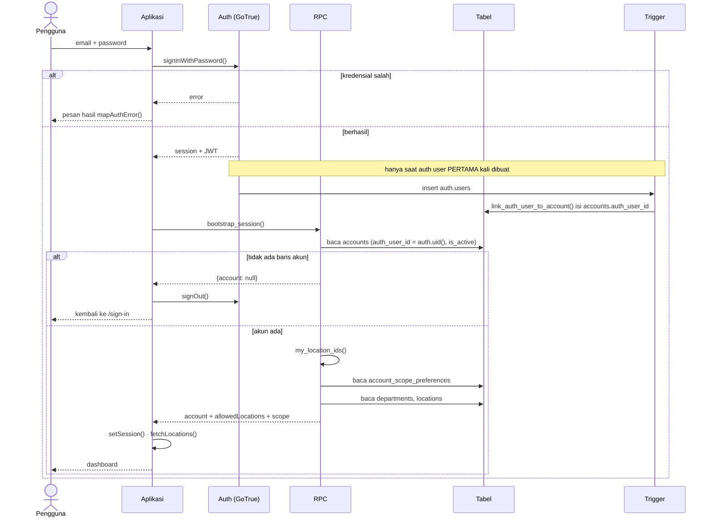

### Langkah demi langkah

1. **Formulir mengirim kredensial.** `signIn()` memanggil
   `supabase.auth.signInWithPassword()` (`src/api/session.ts:33-38`). Galat
   dari GoTrue dilewatkan `mapAuthError()` supaya pesan mentah tidak sampai ke
   layar.
2. **Penautan akun terjadi sekali saja, dan bukan di sini.** Trigger
   `auth_user_created` pada `auth.users`
   (`{M}/20260729100000_auth_session.sql:31-33`) menyala saat Super Admin
   menerbitkan kredensial, bukan saat login. Ia mencocokkan email
   case-insensitive dan hanya mengisi baris yang `auth_user_id is null and
   can_login` (`:22-27`). Jadi **akun harus sudah ada sebelum kredensial
   dibuat**; pendaftaran mandiri dimatikan di `supabase/config.toml:34`.
3. **`bootstrap_session()` mengambil semuanya dalam satu round trip**
   (`supabase/migrations/20260729100000_auth_session.sql:42-100`). SECURITY DEFINER, karena ia
   membaca `account_scope_preferences` untuk pengguna yang konteks RLS-nya
   justru sedang dibangun.
4. **Scope tersimpan dipotong dengan yang diizinkan** (`:60-66`):
   `where p.account_id = me.id and p.location_id = any (allowed)`. Site IT
   tidak dapat memperlebar aksesnya dengan menyunting preferensi.
5. **Login pertama mendapat seluruh scope** (`:68-71`): bila potongan tadi
   kosong, `chosen := allowed`.
6. **Aplikasi menyimpan sesi lalu memuat lokasi** (`src/auth/SessionProvider.tsx:46-58`),
   menyaringnya lagi dengan `allowedLocations` di sisi klien.

### Kalau ada yang gagal

| Kegagalan | Akibat |
| --- | --- |
| Kredensial salah | GoTrue menolak; tidak ada sesi; tidak ada RPC dipanggil |
| Auth berhasil tetapi tidak ada baris `accounts` | `bootstrap_session()` mengembalikan `{account: null}` (`:52-55`). `SessionProvider.tsx:47-51` memanggil `signOut()` lalu membersihkan state — pengguna dikembalikan ke `/sign-in`, tidak dibiarkan masuk setengah jalan |
| Akun ada tetapi `is_active = false` | Sama seperti di atas: klausa `and is_active` (`:51`) membuatnya tidak ditemukan |
| `bootstrap_session()` melempar | `signIn()` melempar ulang (`src/api/session.ts:53`); layar menampilkan galat dan sesi Auth tetap ada — pengguna dapat mencoba lagi tanpa memasukkan sandi lagi |

> **Catatan keamanan.** Login **tidak** menentukan apa yang boleh dilihat.
> `bootstrap_session()` hanya memberi tahu aplikasi apa yang RLS akan izinkan;
> penegakannya terjadi pada setiap query berikutnya. Lihat
> [05-keamanan.md](05-keamanan.md).

---

## Alur 2 — Pendaftaran aset baru dan pembuatan kode

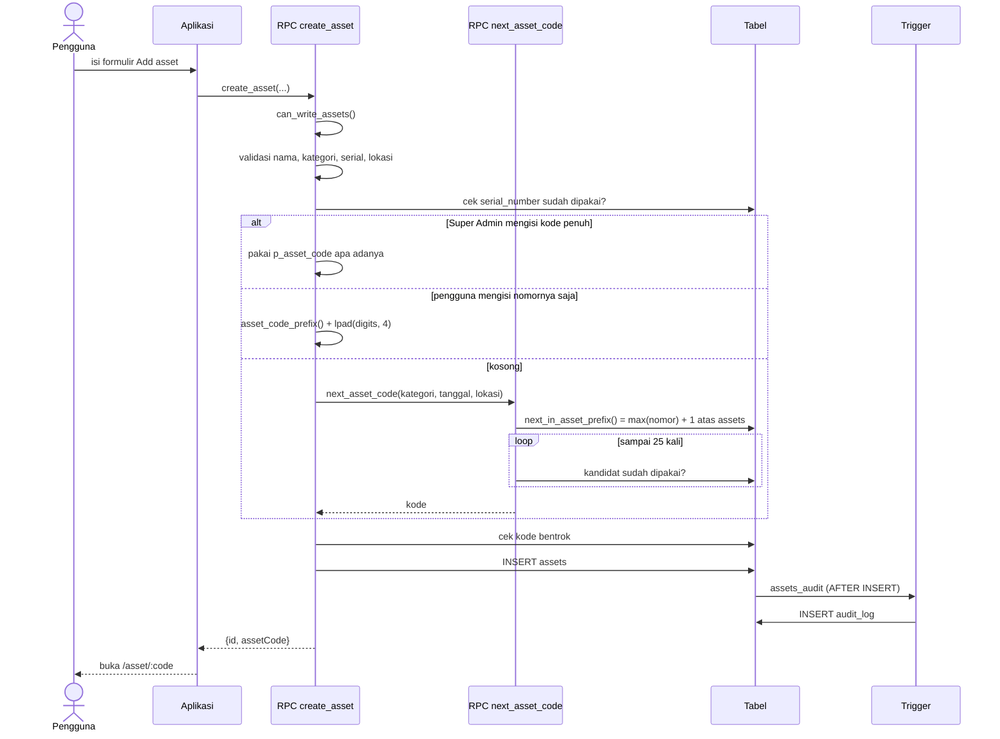

### Langkah demi langkah

1. **Penjagaan dulu** (`supabase/migrations/20260807090000_asset_code_sequence_typed.sql:75-92`):
   `can_write_assets()`, lalu nama, kategori, serial, lokasi wajib, lalu
   `p_location not in (select my_location_ids())` → `That location is outside
   your scope`.
2. **Serial diperiksa case-insensitive** (`:94-96`):
   `lower(a.serial_number) = lower(clean_sn)`. Ini pemeriksaan aplikasi; unique
   constraint pada kolomnya bersifat case-**sensitive**, jadi keduanya tidak
   identik — pemeriksaan di sini lebih ketat.
3. **Tiga cabang kode aset** (`:98-129`):
   - `p_asset_code` diisi → **Super Admin saja** (`:101-103`), dipakai verbatim
     setelah `upper(btrim(...))`. Untuk impor data lama.
   - `p_code_seq` diisi → awalan dihitung ulang server-side, digit dibersihkan
     `regexp_replace(..., '\D', '', 'g')` dan dibatasi 8 karakter (`:115-121`).
   - Keduanya kosong → `next_asset_code()`.
4. **Bentrok kode ditolak** (`:131-133`) sebelum INSERT.
5. **Trigger `assets_audit` menyala** setelah INSERT
   (`supabase/migrations/20260729090000_init_schema.sql:456-457`), menulis `audit_log` dengan
   aksi `asset_created`. Ia SECURITY DEFINER tetapi `auth.uid()` tidak
   terpengaruh, sehingga pelaku yang tercatat tetap orang yang sebenarnya.

### Bagaimana nomor kode sebenarnya dibuat

Ini bagian yang paling mudah salah dijelaskan di naskah, karena skema masih
memuat tabel penghitung yang **sudah tidak dipakai**.

`next_asset_code()` versi akhir (`supabase/migrations/20260806110000_asset_code_format.sql:119-144`)
**tidak menyentuh `asset_code_counters` sama sekali.** Ia memanggil
`next_in_asset_prefix()` (`:89-95`), yang menghitung:

```sql
select coalesce(max((substring(a.asset_code from '(\d+)$'))::int), 0) + 1
from assets a
where a.asset_code like p_prefix || '%'
```

lalu membungkusnya dalam loop hingga 25 percobaan yang memeriksa apakah
kandidat sudah dipakai (`:134-141`).

**Konsekuensi yang perlu dinyatakan:**

| Sifat | Akibat |
| --- | --- |
| Nomor diturunkan dari `max()` atas baris yang ada, bukan dari penghitung | Menghapus aset ber-nomor tertinggi membuat nomor itu **dipakai ulang** oleh aset berikutnya |
| Loop memeriksa keberadaan **sebelum** INSERT | Ada jendela balapan antara pemeriksaan dan penulisan. Yang benar-benar menjaga adalah `unique` pada `assets.asset_code`; dua sesi serentak dapat membuat satu di antaranya gagal dengan 23505, bukan mencoba ulang |
| Batas 25 percobaan | Melempar `Could not allocate an asset code for %` bila terus bentrok |

Bandingkan dengan **nomor BAST**, yang justru memakai penghitung sungguhan
dan karena itu tidak punya kedua sifat di atas — lihat alur 5.

### `asset_code_counters` adalah tabel mati

Satu-satunya tulisan ke tabel itu ada di dua definisi `next_asset_code()` yang
**sudah digantikan**:

```sh
grep -rn "asset_code_counters" supabase/migrations/*.sql | grep -v "^\S*:[0-9]*: *--"
# 20260729090000_init_schema.sql:215  create table
# 20260729090000_init_schema.sql:229  insert   <- next_asset_code() v1, tergantikan
# 20260729150000_fix_counters_and_rename.sql:35  insert  <- v2, tergantikan
# tidak ada lagi
```

Definisi ketiga dan terakhir (`20260806110000:119`) tidak menyebutnya. Jadi
tabel itu ada, tanpa grant, tanpa RLS
([05-keamanan.md](05-keamanan.md) §1.34), dan **tidak ada yang menulis ke
sana**. Ia sisa dari desain penomoran yang ditinggalkan. Dua tabel penghitung
lainnya, `bast_number_counters` dan `tag_code_counters`, masih hidup.

### Kalau ada yang gagal

Seluruh kegagalan me-rollback transaksi; tidak ada baris aset separuh jadi dan
tidak ada baris audit tertinggal. Dua belas pesan galat yang mungkin ada di
[04-katalog-rpc.md](04-katalog-rpc.md) pada entri `create_asset`.

---

## Alur 3 — Serah terima aset (`assign_asset`)

Alur tulis paling padat di seluruh sistem: **empat tabel dalam satu
transaksi**, dengan dua cabang opsional.

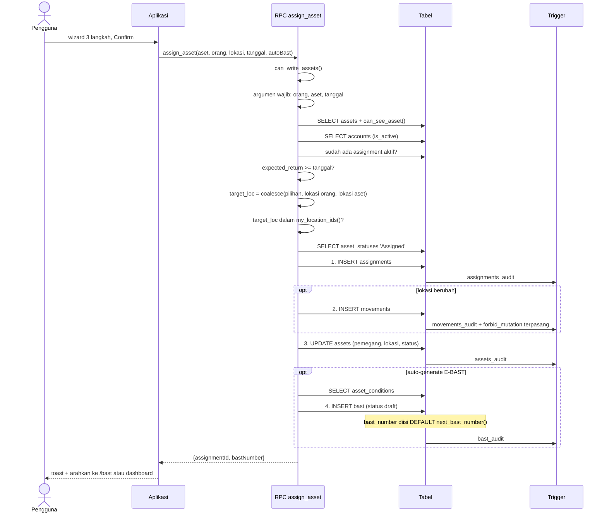

### Activity diagram

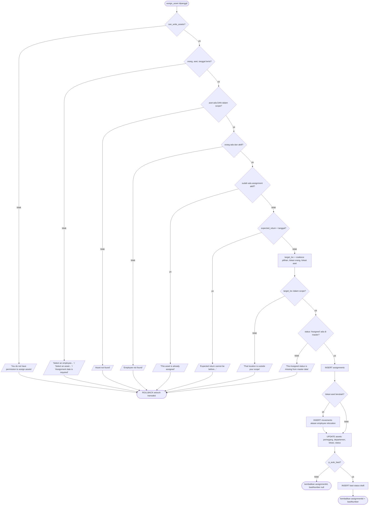

### Urutan penulisan, dan mengapa urutannya begitu

Keempat tulisan terjadi di `supabase/migrations/20260729180000_assign_return_movement.sql:120-146`, berurutan:

| # | Tulisan | Baris | Alasan urutannya |
| ---: | --- | --- | --- |
| 1 | `INSERT assignments` | `supabase/migrations/20260729180000_assign_return_movement.sql:120-127` | Didahulukan supaya index parsial unik `assignments_one_active` menjaga lebih dulu. Bila ada balapan, ia gagal di sini — sebelum `assets` sempat berubah |
| 2 | `INSERT movements` (opsional) | `supabase/migrations/20260729180000_assign_return_movement.sql:130-136` | Hanya bila `a.location_id is distinct from target_loc`. Alasannya di-hardcode `'employee relocation'` |
| 3 | `UPDATE assets` | `supabase/migrations/20260729180000_assign_return_movement.sql:138-144` | Menulis pemegang, departemen, lokasi, dan status sekaligus. Sesudah movements, supaya `from_location` masih memuat lokasi lama |
| 4 | `INSERT bast` (opsional) | `supabase/migrations/20260729180000_assign_return_movement.sql:148-160` | Terakhir, karena ia yang paling boleh tidak ada |

Urutan 2 sebelum 3 adalah keharusan, bukan gaya: `movements.from_location`
diisi `a.location_id`, yang dibaca dari salinan baris **sebelum** UPDATE. Bila
UPDATE didahulukan, `from_location` dan `to_location` akan sama dan CHECK
`from_location <> to_location` (`supabase/migrations/20260729090000_init_schema.sql:274`) akan
menolak seluruh transaksi.

### Cabang auto-generate E-BAST

Dikendalikan `p_auto_bast boolean default true` (`supabase/migrations/20260729180000_assign_return_movement.sql:43`). Bila menyala:

- Kondisi aset dibaca dan diterjemahkan (`supabase/migrations/20260729180000_assign_return_movement.sql:149`, `:158`):
  `case when cond_name = 'Good' then 'Baik / Good' else cond_name end`. Hanya
  kasus umum yang diterjemahkan; sisanya dibiarkan apa adanya — komentarnya
  menyebut alasannya, tidak mau mengarang bahasa Indonesia untuk yang lain.
- Baris `bast` dibuat berstatus `'draft'`, **bukan** `awaiting_signature`.
- `bast_number` **tidak diisi RPC**: ia datang dari DEFAULT kolom
  (`supabase/migrations/20260729090000_init_schema.sql:305`). Lihat alur 5.
- Nomornya dikembalikan lewat `returning bast.bast_number into v_bast` (`supabase/migrations/20260729180000_assign_return_movement.sql:161`).

Bila padam, `bast_number` yang dikembalikan bernilai null dan tidak ada dokumen
dibuat. Penugasannya tetap sah — BAST dapat dibuat menyusul.

### Kalau ada yang gagal

Sepuluh penjagaan, semuanya `P0001`, semuanya sebelum tulisan pertama. Karena
itu **tidak ada kegagalan yang dapat meninggalkan keadaan separuh**: begitu
tulisan pertama terjadi, satu-satunya yang masih bisa gagal adalah constraint
database, dan itu pun me-rollback keempatnya.

Satu kasus layak disebut: bila dua orang menugaskan aset yang sama secara
bersamaan, keduanya lolos pemeriksaan `exists (... state = 'active')` karena
belum ada yang commit. Yang kedua gagal di index parsial unik dengan **23505**,
bukan `P0001` — pesannya menyebut nama index, bukan kalimat yang disiapkan.
`[BELUM TERVERIFIKASI — apakah lapisan API menerjemahkan 23505 pada jalur ini;
`master_delete()` menerjemahkan 23503, tetapi tidak ditemukan penanganan serupa
untuk `assignments_one_active`.]`

---

## Alur 4 — Pengembalian aset

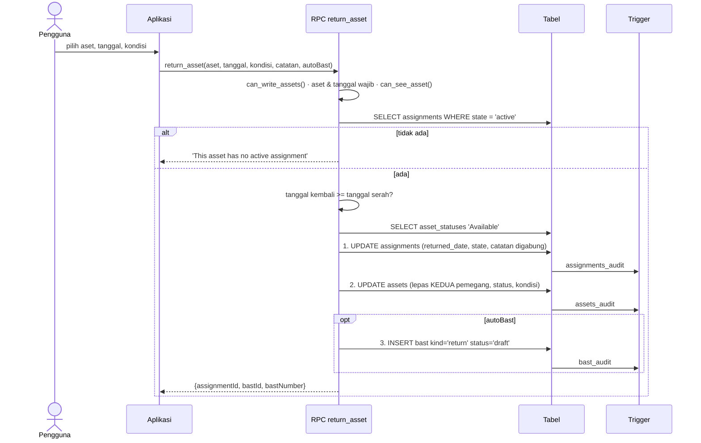

### Langkah demi langkah

1. **Penjagaan** (`supabase/migrations/20260821090600_second_holder_reads.sql:37-48`) — pola baku alur 0.3.
2. **Assignment aktif dicari** (`supabase/migrations/20260821090600_second_holder_reads.sql:50-53`). Ketiadaannya adalah galat
   domain, bukan galat izin: `This asset has no active assignment`.
3. **Tanggal diperiksa mundur** (`supabase/migrations/20260821090600_second_holder_reads.sql:54-56`).
4. **Catatan digabung, tidak ditimpa** (`supabase/migrations/20260821090600_second_holder_reads.sql:69-72`):
   `coalesce(notes || E'\n', '') || clean_notes`. Catatan serah terima asli
   tetap ada di baris yang sama.
5. **Kedua pemegang dilepas** (`supabase/migrations/20260821090600_second_holder_reads.sql:75-82`): `assigned_to = null` **dan**
   `assigned_to_secondary = null`. Satu pengembalian menutup pasangan sekaligus
   — konsekuensi dari desain "satu assignment, dua nama".
6. **BAST penarikan** (`supabase/migrations/20260821090600_second_holder_reads.sql:87-105`) memakai `kind = 'return'` dan membawa
   `secondary_account_id` dari assignment, supaya lembar penarikan memuat blok
   tanda tangan ketiga.

### Penyimpangan dari dokumen desain, yang disengaja

Komentar di `supabase/migrations/20260729180000_assign_return_movement.sql:11-17` menyatakan bahwa DATABASE.md §11 menggambarkan
`return_asset()` memindahkan aset "ke lokasi gudang" — dan bahwa **tidak ada
kolom atau penanda gudang di mana pun dalam skema**, sehingga tidak ada cara
mengetahui lokasi mana yang gudang. Karena itu aset tetap di tempatnya dan
hanya kehilangan pemegangnya; memindahkannya adalah tugas formulir Transfer,
yang menulis baris perpindahan berikut alasannya.

Ini contoh baik untuk naskah: kode menolak mengarang mekanisme yang tidak ada
di skema, dan mencatat penolakannya di tempat yang akan dibaca orang
berikutnya.

### Kalau ada yang gagal

Tujuh penjagaan, semuanya sebelum tulisan pertama. Kegagalan constraint
sesudahnya me-rollback ketiganya. Bila `p_auto_bast` menyala dan INSERT `bast`
gagal — misalnya karena `location_id` aset menunjuk lokasi yang dihapus —
**pengembaliannya ikut batal**, dan aset tetap tercatat dipegang orang.

---

## Alur 5 — Penerbitan nomor E-BAST dan penandatanganan sampai `complete`

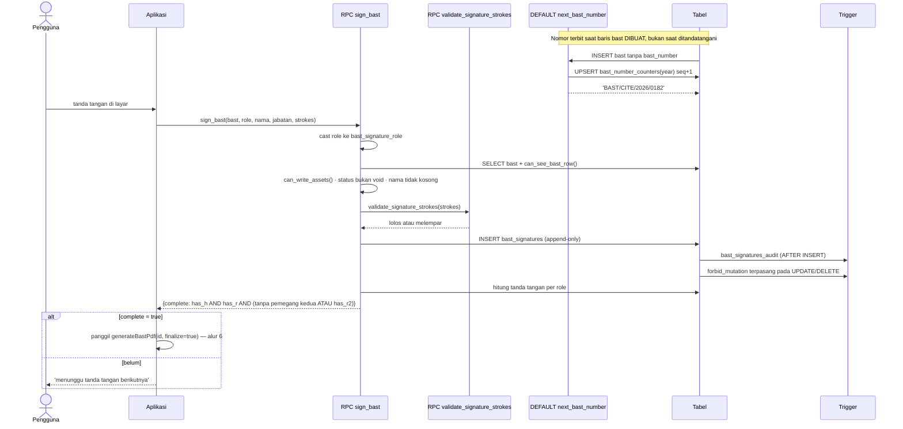

### Activity diagram

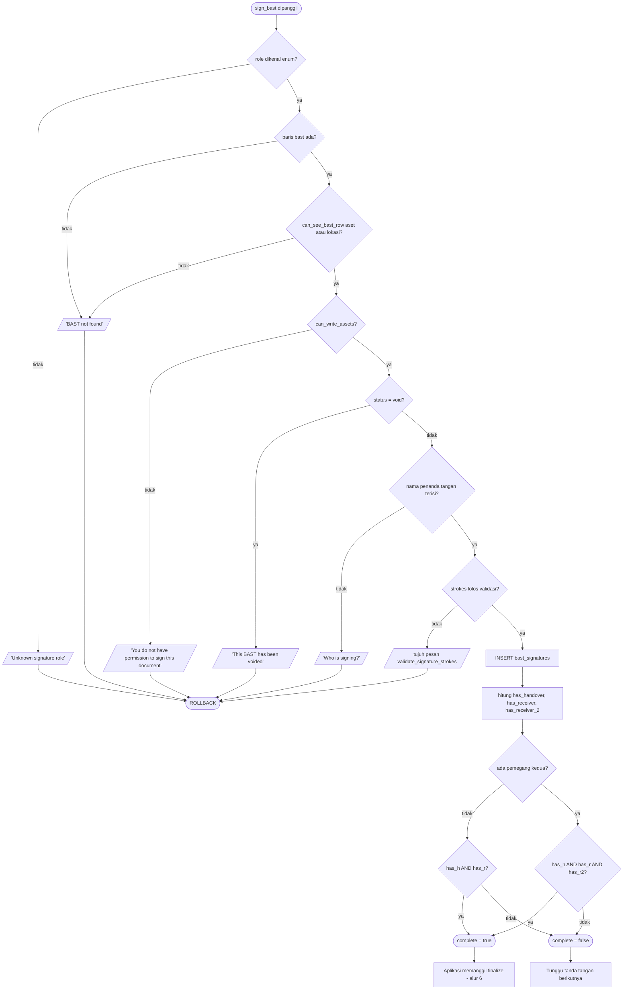

### Nomor terbit lebih awal daripada yang orang kira

Nomor BAST **tidak** diterbitkan saat penandatanganan. Ia adalah DEFAULT kolom
(`supabase/migrations/20260729090000_init_schema.sql:305`):

```sql
bast_number text not null unique default next_bast_number(),
```

Artinya nomor terpakai pada saat baris `bast` dibuat — yaitu di dalam
`assign_asset()` (alur 3), `return_asset()` (alur 4), atau
`create_accessory_bast()` (alur 9). Konsekuensinya:

- **Draf yang tidak pernah ditandatangani tetap menghabiskan nomor.** Nomor
  tidak dipakai ulang. `void_bast()` (alur 7) menyebut ini eksplisit: "the
  number stays spent".
- **INSERT yang lupa menyertakan nomor tetap mendapat nomor sah.** Tidak ada
  jalur penulisan yang dapat menghasilkan baris tanpa nomor.
- `next_bast_number()` (`supabase/migrations/20260729150000_fix_counters_and_rename.sql:44-52`)
  memakai UPSERT pada `bast_number_counters` per tahun:
  `on conflict (year) do update set seq = seq + 1 returning seq`. Ini
  **penghitung sungguhan** dan atomik — berbeda dari kode aset (alur 2) yang
  memakai `max()+1` dan punya jendela balapan.

### `complete` bukan `status = 'signed'`

Ini pembedaan yang paling sering salah dibaca, dan kodenya menyatakannya dua
kali. `sign_bast()` mengembalikan `complete` (`supabase/migrations/20260821090500_second_holder.sql:176`):

```sql
'complete', has_h and has_r and (b.secondary_account_id is null or has_r2)
```

Tetapi ia **tidak menyentuh `bast.status`**. Status berpindah ke `'signed'`
hanya lewat `attach_signed_bast()`, yaitu setelah PDF bertanda tangan benar-benar
ada. Komentar di `supabase/migrations/20260731090000_ebast_signatures.sql:37-43` menjelaskan
alasannya: supaya "Signed" tetap punya satu makna — dokumennya ada. Bila
langkah PDF gagal, tanda tangannya sudah aman dan operasinya tinggal diulang.

### Menandatangani ulang diperbolehkan

Tidak ada unique constraint pada `(bast_id, role)`. Menandatangani lagi
menyisipkan baris baru; yang terbaru yang dicetak, dan setiap percobaan
sebelumnya tetap tersimpan (`supabase/migrations/20260731090000_ebast_signatures.sql:29-35`).
Ini sengaja lebih longgar daripada UNIQUE — seseorang akan mencoreng tanda
tangannya dan ingin mengulang — tanpa menghancurkan apa pun. Tabelnya
append-only tiga lapis ([05-keamanan.md](05-keamanan.md) §4.1).

### Kalau ada yang gagal

| Kegagalan | Akibat |
| --- | --- |
| `validate_signature_strokes()` menolak | Seluruh transaksi batal; tidak ada baris tanda tangan. Validasi berjalan di database, bukan di aplikasi, karena perender PDF tidak punya cara pulih dari path rusak — ia akan memancarkan content stream cacat dan dokumennya gagal dibuka |
| Dokumen sudah void | `This BAST has been voided`; void bersifat final untuk penandatanganan |
| Tanda tangan tersimpan tetapi langkah PDF gagal | **Tanda tangannya tetap ada.** Ini pemisahan yang disengaja: dua panggilan terpisah, bukan satu transaksi |

---

## Alur 6 — Render PDF oleh Edge Function dan penyimpanan versi

Satu-satunya alur yang **melintasi batas transaksi**: Edge Function melakukan
tiga operasi berurutan yang tidak saling melindungi.

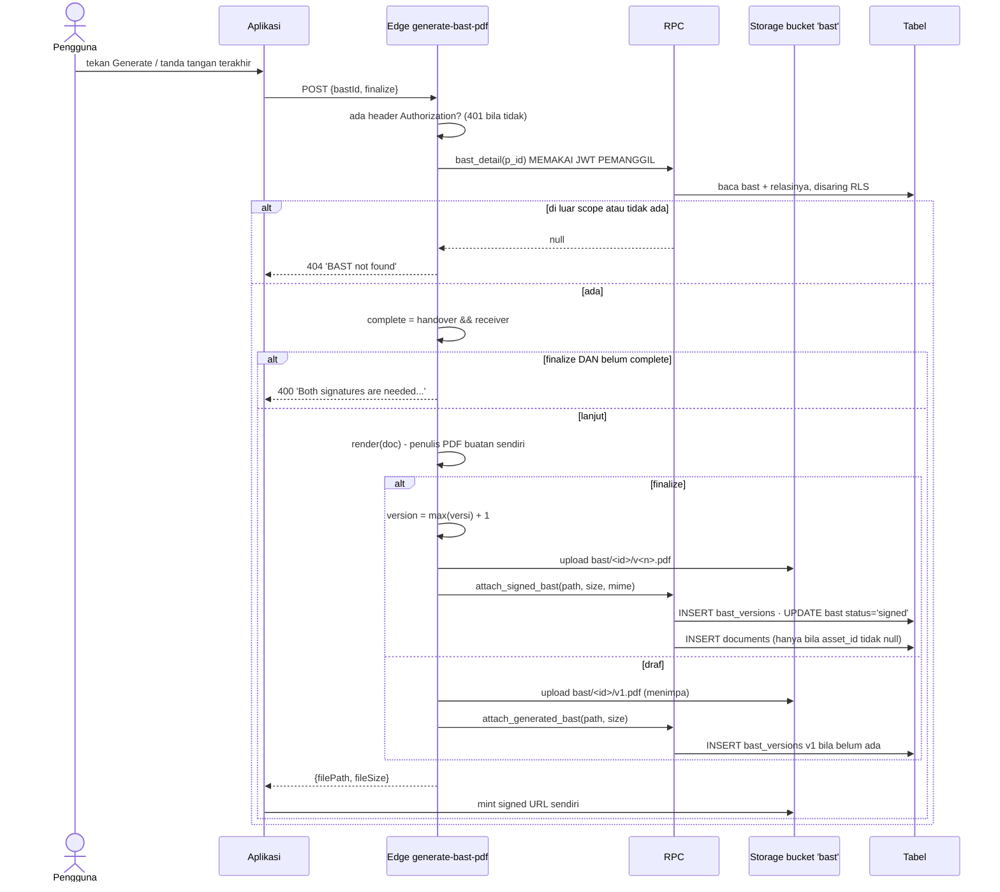

### Langkah demi langkah

1. **Autentikasi diteruskan, bukan digantikan** (`supabase/functions/generate-bast-pdf/index.ts:512-525`). Edge
   Function membuat `Api` dengan **anon key + header Authorization pemanggil**,
   bukan service role. Karena itu `bast_detail()` tetap tunduk RLS: dokumen di
   luar scope kembali sebagai `null`, bukan 403 (`supabase/functions/generate-bast-pdf/index.ts:527-529`). `verify_jwt =
   true` di `supabase/config.toml:56-57` menegaskannya.
2. **PDF dirender tanpa pustaka** (`supabase/functions/generate-bast-pdf/index.ts:536`). Penulis PDF 1.4 buatan sendiri
   di `supabase/functions/generate-bast-pdf/pdf.ts:1-10`; alasannya dokumen
   hanya butuh lima primitif dan fungsi tanpa dependensi cold-start lebih cepat
   serta tidak bisa hanyut versinya.
3. **Dua mode berbeda tajam:**

| | `finalize = false` (draf) | `finalize = true` |
| --- | --- | --- |
| Nama berkas | `<id>/v1.pdf` selalu (`supabase/functions/generate-bast-pdf/index.ts:563`) | `<id>/v<max+1>.pdf` (`supabase/functions/generate-bast-pdf/index.ts:541-542`) |
| Efek di Storage | **Menimpa** objek yang sama | Objek baru |
| RPC | `attach_generated_bast()` | `attach_signed_bast()` |
| Status BAST | tidak berubah | menjadi `'signed'` |

   Alasan v1 selalu menimpa ditulis di `supabase/functions/generate-bast-pdf/index.ts:561-563`: `bast_versions`
   append-only dan tidak dapat di-UPDATE, jadi regenerasi draf tidak boleh
   menumbuhkan riwayat versi.
4. **Signed URL sengaja tidak dikembalikan** (`supabase/functions/generate-bast-pdf/index.ts:571-573`): di dalam Edge
   runtime `SUPABASE_URL` adalah host internal stack, sehingga URL yang dibuat
   di sana tidak terjangkau dari ponsel. Klien membuatnya sendiri dari
   `filePath`.

### Yang terjadi kalau langkah tengah gagal — dan ini yang penting

Ketiga operasi (`upload`, lalu `rpc`) adalah **panggilan HTTP terpisah**. Tidak
ada transaksi yang membungkusnya. Karena itu:

| Gagal di | Keadaan yang tertinggal |
| --- | --- |
| `bast_detail()` | Bersih — belum ada apa pun yang ditulis |
| `render()` | Bersih |
| `upload` ke Storage | Bersih di database; tidak ada baris versi |
| **`attach_signed_bast()` sesudah upload berhasil** | **Berkas ada di bucket, tetapi tidak ada baris `bast_versions` yang menunjuknya, dan status BAST tetap bukan `signed`.** Byte yatim |

Untuk mode draf, keadaan yatim itu tidak berbahaya — panggilan berikutnya
menimpa `v1.pdf` yang sama. Untuk mode finalize, ia menyisakan `v<n>.pdf` yang
tidak tercatat, dan percobaan berikutnya akan memakai `max+1` yang sama
sehingga menimpanya. Jadi sistem pulih sendiri, tetapi lewat penimpaan, bukan
lewat pembersihan.

### Temuan: gerbang `complete` di Edge Function melewatkan pemegang kedua

Ini ketidakcocokan nyata antara dua tempat yang menghitung hal yang sama.

| Tempat | Ekspresi | Memperhitungkan `receiver_2`? |
| --- | --- | --- |
| `sign_bast()` — `supabase/migrations/20260821090500_second_holder.sql:176` | `has_h and has_r and (b.secondary_account_id is null or has_r2)` | **Ya** |
| Edge Function — `supabase/functions/generate-bast-pdf/index.ts:531` | `Boolean(doc.signatures?.handover && doc.signatures?.receiver)` | **Tidak** |

Edge Function itu sendiri **mengenal** `receiver_2`: tipenya menyebutnya
(`supabase/functions/generate-bast-pdf/index.ts:164`) dan perendernya menggambar blok tanda tangan ketiga (`supabase/functions/generate-bast-pdf/index.ts:400`).
Hanya gerbangnya yang tidak.

Akibatnya: sebuah BAST dengan dua pemegang dapat difinalisasi — PDF diunggah,
`attach_signed_bast()` dipanggil, status menjadi `'signed'` — **dengan blok
tanda tangan ketiga kosong**.

**Jalur aplikasi tidak terkena.** `app/(tabs)/bast/sign.tsx:132-133` memanggil
`signBast()` lebih dulu dan hanya melanjutkan bila `complete` bernilai true,
dan nilai itu datang dari `sign_bast()` yang benar. Celahnya hanya terbuka bagi
pemanggilan langsung Edge Function dengan `finalize: true` oleh pengguna yang
sudah masuk dan punya izin tulis.

Ini kelas yang sama dengan temuan [05-keamanan.md](05-keamanan.md) §5.5 dan
§5.6: **satu aturan ditulis di dua tempat, dan salinan keduanya tertinggal.**
Aturan yang otoritatif ada di `sign_bast()`; Edge Function menyalinnya dan
melewatkan kasus pemegang kedua yang ditambahkan belakangan oleh migrasi 0048.

---

## Alur 7 — Void E-BAST

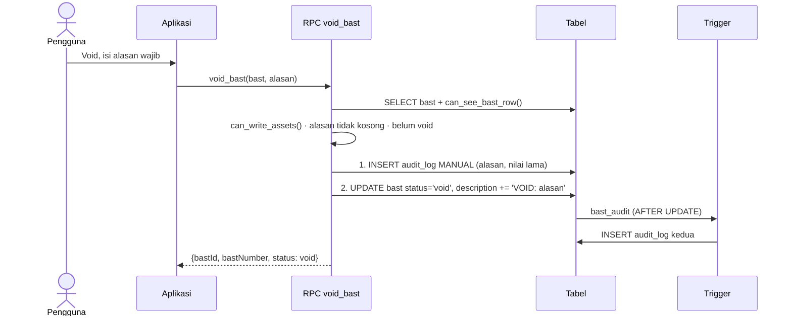

### Langkah demi langkah

1. **Empat penjagaan** (`supabase/migrations/20260824090300_delete_account_and_void_bast.sql:116-129`): dokumen ada dan terlihat, boleh
   menulis, alasan wajib (`Say why this document is being voided`), dan belum
   void (`That document is already void`).
2. **Audit ditulis MANUAL sebelum perubahan** (`supabase/migrations/20260824090300_delete_account_and_void_bast.sql:131-140`). Ini pelanggaran
   aturan kerja #3 yang disengaja — lihat
   [04-katalog-rpc.md](04-katalog-rpc.md) §ZZ.1. Alasannya: trigger tahu apa
   yang berubah, tidak tahu **mengapa**, dan alasan itulah satu-satunya bagian
   yang berguna dibaca enam bulan kemudian.
3. **Alasan juga ditempel ke `description`** (`supabase/migrations/20260824090300_delete_account_and_void_bast.sql:146`):
   `coalesce(description || E'\n', '') || 'VOID: ' || btrim(p_reason)` —
   sehingga muncul pada dokumen itu sendiri, bukan hanya di log.

### Dua baris audit untuk satu tindakan

Perlu dinyatakan di naskah supaya tidak terbaca sebagai bug: satu operasi void
menghasilkan **dua** baris `audit_log`.

| # | Sumber | Isi |
| ---: | --- | --- |
| 1 | INSERT manual di `supabase/migrations/20260824090300_delete_account_and_void_bast.sql:131-140` | `old_value` = seluruh baris, `new_value` = `{status: void, reason: ...}`, `target_label` = nomor BAST |
| 2 | Trigger `bast_audit` AFTER UPDATE (`supabase/migrations/20260729090000_init_schema.sql:462-463`) | before/after generik dari baris, aksi `bast_signed` |

Keduanya memakai aksi enum yang tidak persis menggambarkan void: yang manual
memakai `'bast_generated'`, yang trigger memakai `'bast_signed'` (argumen kedua
untuk UPDATE). **Tidak ada nilai `bast_voided` di enum `audit_action`** —
lihat [02-kamus-data.md](02-kamus-data.md) §6.7. Jadi menyaring log untuk
"dokumen mana yang di-void" tidak dapat dilakukan lewat kolom `action`;
harus lewat `new_value ->> 'status'`.

### Mengapa void, bukan hapus

Komentar di `supabase/migrations/20260824090300_delete_account_and_void_bast.sql:37-48` menyatakan pilihannya: sebuah Berita Acara adalah
bukti bahwa serah terima terjadi, dan `bast_versions` append-only tiga lapis.
Karena itu ada dua jalur berbeda:

- `void_bast()` — selalu tersedia. Status menjadi `void`, **nomornya tetap
  terpakai**, alasannya tercatat, dan lembar itu berhenti dihitung.
- `delete_bast()` — hanya untuk draf yang belum pernah ditandatangani, belum
  punya PDF, dan belum punya tanda tangan. Itu dokumen yang dibuat karena
  kekeliruan, dan tidak ada yang perlu dilestarikan.

### Kalau ada yang gagal

Keempat penjagaan berjalan sebelum tulisan pertama. Bila UPDATE gagal sesudah
INSERT audit manual, **keduanya ter-rollback bersama** — keduanya di dalam satu
transaksi RPC yang sama. Tidak ada baris audit yang mengklaim void yang tidak
terjadi.

---

## Alur 8 — Pemasangan aset ke unit kendaraan

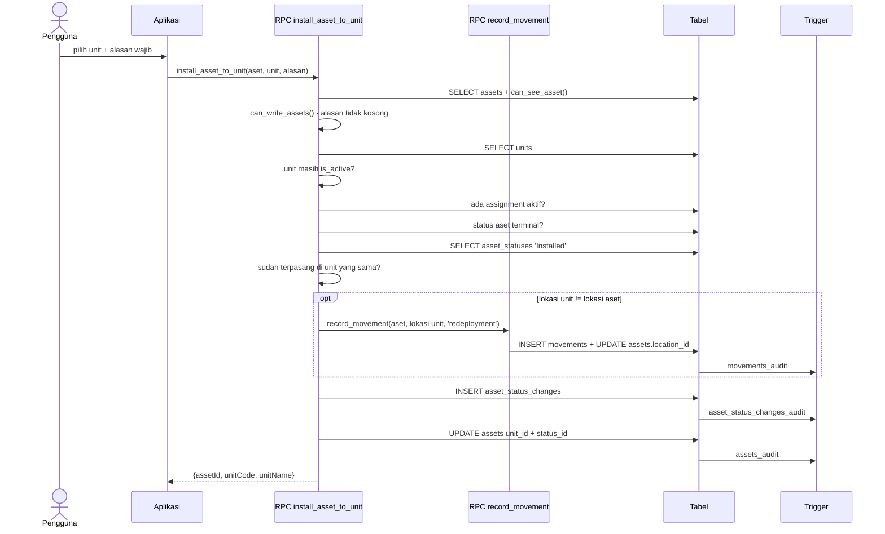

### Langkah demi langkah

1. **Enam penjagaan berurutan** (`supabase/migrations/20260821090000_install_to_unit.sql:53-92`), dan urutannya bermakna:
   aset terlihat → boleh menulis → alasan wajib → unit ada → unit masih
   `is_active` → tidak sedang dipegang orang → status belum terminal → belum
   terpasang di unit yang sama.
2. **Tidak boleh dipasang bila masih dipegang** (`supabase/migrations/20260821090000_install_to_unit.sql:76-80`): pesannya
   menyebut nama pemegangnya, `Return this asset first — % still has it`. Sebuah
   radio tidak dapat sekaligus berada di tangan orang dan terpasang di truk.
3. **Aset terminal ditolak** (`supabase/migrations/20260821090000_install_to_unit.sql:82-86`): `This asset is % and cannot be
   fitted to anything` — Retired atau Lost.
4. **Perpindahan lokasi didelegasikan** (`supabase/migrations/20260821090000_install_to_unit.sql:97-100`). Bila lokasi unit
   berbeda, ia **memanggil `record_movement()`**, bukan menulis `movements`
   sendiri. Ini berarti seluruh penjagaan `record_movement()` ikut berlaku, dan
   baris perpindahannya tidak dapat dibedakan dari yang dibuat lewat formulir
   Transfer.
5. **Riwayat status ditulis lalu aset diperbarui** (`supabase/migrations/20260821090000_install_to_unit.sql:102-108`).

### Kebalikannya sengaja tidak simetris

`remove_asset_from_unit()` (`supabase/migrations/20260821090000_install_to_unit.sql:120-157`) mengembalikan status ke
`'Available'` tetapi **tidak memindahkan lokasi aset kembali**. Alasannya
ditulis di `supabase/migrations/20260821090000_install_to_unit.sql:122-126`: keluar dari kendaraan tidak berarti diserahkan
kepada siapa pun, dan radio itu secara fisik tetap di Site sampai ada yang
mencatat perpindahan. Pemasangan boleh menggeser lokasi karena kendaraannya
memang membawa aset itu pergi; pelepasan tidak, karena tidak ada yang membawanya
pulang.

### Kalau ada yang gagal

Delapan penjagaan sebelum tulisan pertama. Bila `record_movement()` melempar —
misalnya lokasi unit di luar scope pemanggil — **seluruh pemasangan batal**,
karena panggilan bersarang itu berada di dalam transaksi yang sama.

---

## Alur 9 — Keluar dan kembalinya perlengkapan

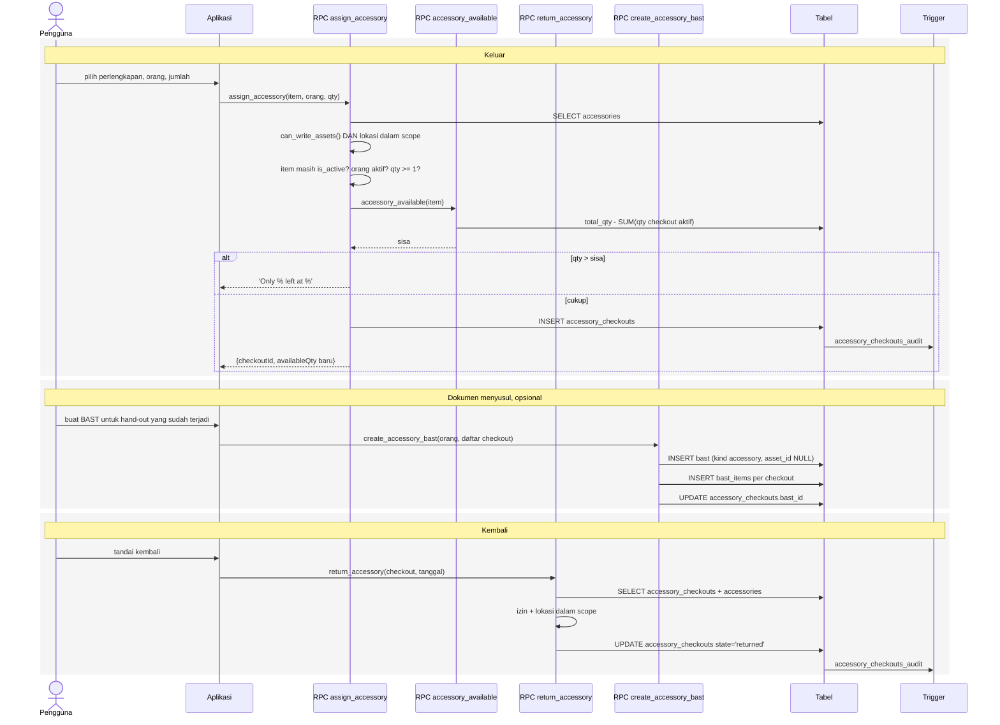

### Ketersediaan dihitung, tidak disimpan

Ini keputusan desain yang paling menentukan di modul ini.
`accessory_available()` (`supabase/migrations/20260821090200_accessories.sql:116-122`):

```sql
select greatest(0,
  coalesce((select total_qty from accessories where id = p_id), 0)
  - coalesce((select sum(qty) from accessory_checkouts
             where accessory_id = p_id and state = 'active'), 0))
```

Tidak ada kolom `available_qty`. Konsekuensinya: **angka sisa tidak dapat
menyimpang dari kenyataan**, karena ia bukan salinan. Harganya adalah satu
agregasi setiap kali ditanya.

### Stok bergerak di satu tempat saja

`create_accessory_bast()` (`supabase/migrations/20260821090200_accessories.sql` dan `supabase/migrations/20260821090300_accessory_bast.sql:132-220`)
membungkus hand-out yang **sudah terjadi** dengan sebuah dokumen. Komentarnya
menyatakan alasannya: ia tidak mengeluarkan stok apa pun sendiri, sehingga
kegagalan di sana tidak akan pernah membuat hitungan rak salah. Hal yang sama
berlaku untuk `attach_accessories_to_bast()`.

Jadi hanya `assign_accessory()` dan `return_accessory()` yang menggerakkan
stok. Pembuatan dokumen adalah lapisan terpisah di atasnya.

### Perbedaan penting dari penugasan aset

| | Aset (`assignments`) | Perlengkapan (`accessory_checkouts`) |
| --- | --- | --- |
| Index parsial `state = 'active'` | **UNIQUE** | **tidak unique** |
| Akibat | satu aset, satu pemegang | satu jenis, banyak pemegang serentak |
| Kolom jumlah | tidak ada | `qty` dengan CHECK `> 0` |
| BAST | dibuat di dalam transaksi yang sama | dibuat terpisah sesudahnya |

Perbedaan satu kata kunci `unique` itulah yang membedakan barang ber-nomor-seri
dari barang yang dihitung per jumlah — lihat [03-erd.md](03-erd.md) §D.

### Kalau ada yang gagal

Kekurangan stok ditolak **sebelum** INSERT, dengan pesan yang menyebut angka
dan lokasinya: `Only % left at %` (`supabase/migrations/20260821090200_accessories.sql:357-360`). Karena ketersediaan dihitung
ulang di dalam transaksi yang sama, dua hand-out serentak tidak dapat
melampaui stok — yang kedua membaca jumlah checkout yang sudah termasuk yang
pertama, asalkan yang pertama sudah commit.
`[BELUM TERVERIFIKASI — perilaku pada dua transaksi yang benar-benar
bersamaan sebelum commit; tanpa `select ... for update` pada baris
`accessories`, dua sesi dapat sama-sama membaca sisa yang sama. Membuktikannya
memerlukan uji konkurensi terhadap database berjalan.]`

---

## Alur 10 — Import karyawan

Fungsi terbesar di seluruh sistem: **314 baris**, satu lintasan per baris CSV,
dan pratinjau memakai kode yang sama persis dengan komit.

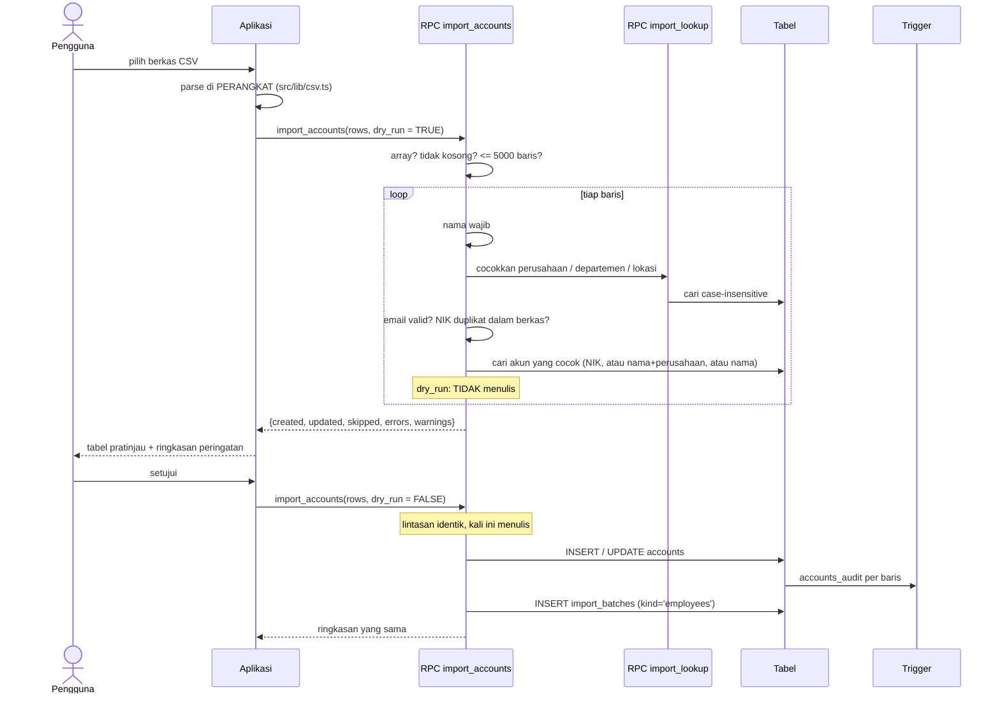

### Activity diagram — per baris CSV

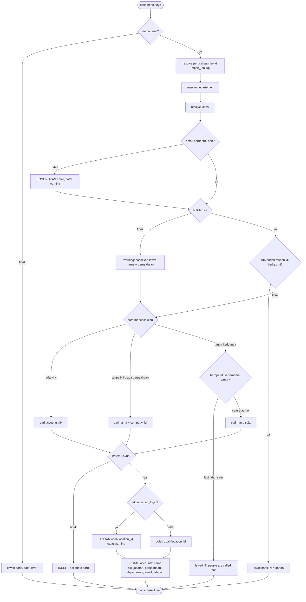

### Empat penjagaan berkas, sebelum baris mana pun disentuh

`supabase/migrations/20260824090200_import_location.sql:79-87`:

| Penjagaan | Pesan |
| --- | --- |
| Bukan array JSON | `The file could not be read` |
| Nol baris | `The file has no rows` |
| Lebih dari 5000 baris | `That is more than 5000 rows — split the file` |
| Bukan Super Admin | `assert_can_manage_accounts()` |

### Pratinjau dan komit adalah kode yang sama

`p_dry_run boolean default true` adalah satu-satunya perbedaan. Seluruh
resolusi, pencocokan, validasi, dan penghitungan berjalan identik; hanya tiga
blok tulis yang dibungkus `if not p_dry_run` (`supabase/migrations/20260824090200_import_location.sql:252`, `:298`, `:315`).

Ini menjawab masalah nyata: sebuah endpoint "validate" yang terpisah pada
akhirnya akan berbeda dari importir yang sesungguhnya, dan perbedaannya hanya
akan muncul sebagai baris yang hilang tanpa penjelasan. Pola yang sama dipakai
`import_assets()`.

### Tiga strategi pencocokan, berjenjang

`supabase/migrations/20260824090200_import_location.sql:186-220`:

| Kunci tersedia | Cara mencocokkan | Alasan |
| --- | --- | --- |
| NIK | `lower(nik) = lower(v_nik)` | NIK adalah identitas ketika ada |
| Tanpa NIK, ada perusahaan | `lower(full_name)` + `company_id is not distinct from` | Inilah yang menjaga "Ruli Tanio" (SPR) dan "Ruli Tanio SMA" (SMA) tetap dua orang berbeda |
| Tanpa keduanya | nama saja, **hanya bila unik** | Bila lebih dari satu, baris ditolak: `% people are called that — add an Employee ID or Company column` |

Cabang ketiga adalah bagian yang paling patut dikutip di naskah. Menebak akan
**diam-diam menimpa orang yang salah** (`supabase/migrations/20260824090200_import_location.sql:198-203`), jadi barisnya ditolak
dan pesannya menyebutkan cara memperbaikinya.

### Nilai berantakan dikosongkan, bukan menggugurkan baris

Keputusan klien, dicatat di header migrasi: berkas nyatanya membawa 2 email
cacat dan 23 employee ID kosong — termasuk milik Presiden Direktur. Baris-baris
itu tetap menggambarkan orang sungguhan yang memegang laptop sungguhan, jadi
**nilainya** yang dibuang dan dilaporkan sebagai peringatan, sementara
**orangnya** tetap diimpor.

Hanya dua hal yang menggugurkan baris: tidak ada nama sama sekali, dan NIK yang
sudah diklaim baris lain di berkas yang sama.

### Satu asimetri yang disengaja: lokasi akun yang bisa login

`supabase/migrations/20260824090200_import_location.sql:272-280`. Bila akun yang cocok punya `can_login = true`, kolom
`location_id`-nya **tidak disentuh**, dan barisnya melaporkan peringatan yang
menyebut nama orangnya.

Alasannya ditulis di header: bagi orang yang hanya **menerima** aset,
`location_id` sekadar label. Bagi orang yang bisa **masuk**, kolom itu adalah
scope RLS — himpunan aset yang boleh ia lihat. Membiarkan spreadsheet
mengubahnya berarti impor bulanan rutin dapat diam-diam melebarkan atau
menyempitkan akses seseorang, dan tidak ada apa pun di layar yang akan
mengatakannya.

Kolom yang tetap tidak dapat disentuh impor sama sekali: `role`, `can_login`,
`auth_user_id`, dan `is_active` — keempatnya menentukan apa yang **boleh
dilakukan** seseorang, dan hanya disetel di dalam aplikasi.

### Kalau ada yang gagal

| Kegagalan | Akibat |
| --- | --- |
| Satu baris cacat | Baris itu dilewati dan dicatat di `errors`; sisanya lanjut |
| Penjagaan berkas gagal | Melempar sebelum baris mana pun diproses; tidak ada tulisan |
| Kegagalan di tengah komit | **Seluruh impor ter-rollback** — satu RPC, satu transaksi. Termasuk baris `import_batches` yang ditulis paling akhir (`supabase/migrations/20260824090200_import_location.sql:315-320`), sehingga tidak ada riwayat impor yang mengklaim keberhasilan yang tidak terjadi |

Karena `import_batches` ditulis **terakhir**, ia berfungsi sebagai penanda
commit: keberadaan barisnya berarti seluruh baris di dalamnya benar-benar
tersimpan.

---

## Alur 11 — Perubahan status aset dengan alasan

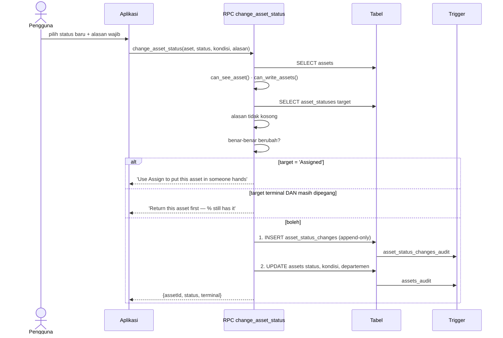

### Mengapa ada tabel riwayat terpisah, padahal sudah ada audit_log

Dijawab di header migrasinya (`supabase/migrations/20260731140000_status_changes.sql:7-19`): `audit_log` sudah merekam setiap
update pada `assets` berikut pelakunya, jadi "siapa yang mengubah" terjawab di
sana. Yang tidak dapat ditampungnya adalah **mengapa** — ia before/after generik
yang ditulis trigger yang tidak tahu apa-apa soal maksud. "Retired" dan "Lost"
adalah suntingan baris yang sama; perbedaan di antara keduanya, dan alasan di
baliknya, justru bagian yang dibutuhkan seseorang enam bulan kemudian ketika
auditor bertanya ke mana laptop itu pergi.

Keduanya bukan alternatif — `audit_log` tetap bekerja di bawahnya, dan tidak ada
apa pun di sini yang menulis ke `audit_log` secara manual.

### Empat aturan domain

| Aturan | Baris | Pesan |
| --- | --- | --- |
| Alasan wajib | `supabase/migrations/20260731140000_status_changes.sql:101-103` | `Please say why the status is changing` |
| Harus benar-benar berubah | `supabase/migrations/20260731140000_status_changes.sql:107-109` | `That is already the status` |
| `Assigned` tidak boleh disetel manual | `supabase/migrations/20260731140000_status_changes.sql:114-117` | `Use Assign to put this asset in someone's hands` |
| Terminal ditolak bila masih dipegang | `supabase/migrations/20260731140000_status_changes.sql:120-124` | `Return this asset first — % still has it` |

Aturan keempat adalah inti alur ini. Alasannya bukan karena update-nya sulit,
melainkan karena register akan mengklaim sebuah perangkat sudah dilepas
sementara ada orang yang masih membawanya, dan tidak ada laporan berikutnya
yang dapat memberi tahu bahwa itu terjadi. Kembalikan dulu — itu satu ketukan,
dan menghasilkan catatan siapa yang menyerahkannya.

Satu efek samping yang mudah terlewat (`supabase/migrations/20260731140000_status_changes.sql:138`): saat status target
terminal, `department_id` aset **dikosongkan**. Aset yang sudah pensiun tidak
lagi milik departemen mana pun.

---

## Alur 12 — Perawatan: buka, tutup, dan pemulihan status

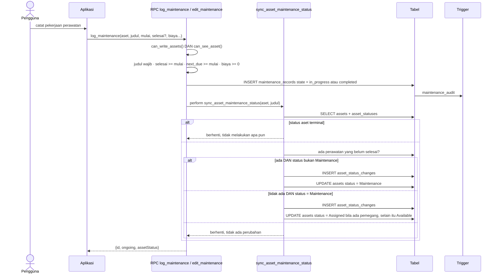

### Satu helper untuk dua arah

`sync_asset_maintenance_status()` (`supabase/migrations/20260804140000_bast_documents_and_maintenance_status.sql:572-630`) dipanggil `perform` dari
**kedua** jalur tulis — `log_maintenance()` (`supabase/migrations/20260804140000_bast_documents_and_maintenance_status.sql:686`) dan
`edit_maintenance()` (`supabase/migrations/20260804140000_bast_documents_and_maintenance_status.sql:741`). Komentarnya menyatakan alasannya: satu
helper yang dipanggil kedua jalur supaya kedua arah tidak mungkin
diimplementasikan berbeda — **yang justru penyebab bug aslinya**.

Ia **bukan trigger**. Tidak ada `create trigger` yang menyebutnya; ia fungsi
biasa yang dipanggil eksplisit. Lihat [02-kamus-data.md](02-kamus-data.md)
§2.12.

### Logika pemulihan status

| Keadaan | Tindakan | Baris |
| --- | --- | --- |
| Status aset terminal | **Berhenti** — Retired/Lost tidak dipindahkan apa pun | `supabase/migrations/20260804140000_bast_documents_and_maintenance_status.sql:603` |
| Ada perawatan belum selesai, status sudah `Maintenance` | Berhenti, tidak ada perubahan | `supabase/migrations/20260804140000_bast_documents_and_maintenance_status.sql:611` |
| Ada perawatan belum selesai, status lain | → `Maintenance` | `supabase/migrations/20260804140000_bast_documents_and_maintenance_status.sql:612-613` |
| Tidak ada yang belum selesai, status **bukan** `Maintenance` | Berhenti | `supabase/migrations/20260804140000_bast_documents_and_maintenance_status.sql:617` |
| Tidak ada yang belum selesai, status `Maintenance` | → `Assigned` bila masih ada pemegang, selain itu `Available` | `supabase/migrations/20260804140000_bast_documents_and_maintenance_status.sql:618-620` |

Baris keempat adalah yang menjaga helper ini tidak merusak apa pun: ia hanya
memulangkan aset dari `Maintenance`, tidak pernah dari status lain. Sebuah aset
`Available` yang perawatannya ditutup tetap `Available`.

Pemulihan ke `Assigned` bila `assigned_to` masih terisi adalah detail yang
mudah terlewat: aset yang masuk bengkel sambil tetap tercatat dipegang
seseorang akan kembali ke tangan orang itu, bukan ke rak.

### Setiap perpindahan status meninggalkan jejak

Helper ini menulis `asset_status_changes` (`supabase/migrations/20260804140000_bast_documents_and_maintenance_status.sql:623-627`) dengan alasan yang
dibentuk otomatis: `'In for maintenance — ' || judul` atau
`'Back from maintenance — ' || judul`. Jadi perpindahan status yang dipicu
perawatan tidak dapat dibedakan bentuknya dari yang dilakukan manusia lewat
alur 11 — keduanya baris `asset_status_changes` yang beralasan.

### Kalau ada yang gagal

`log_maintenance()` adalah **SECURITY INVOKER**, sedangkan
`sync_asset_maintenance_status()` **SECURITY DEFINER**. Keduanya tetap dalam
satu transaksi, jadi kegagalan helper me-rollback catatan perawatannya juga.
Helper mengulang pemeriksaan izinnya sendiri di awal — `can_write_assets()` dan
`can_see_asset()` (`supabase/migrations/20260804140000_bast_documents_and_maintenance_status.sql:587-590`) — karena sebagai DEFINER ia melewati RLS
dan tidak boleh mengandalkan pemanggilnya.

---

## 13. Verifikasi dan temuan

### 13.1 Kelima belas diagram sudah dirender

Seluruh blok Mermaid diekstrak dan dijalankan melalui
`@mermaid-js/mermaid-cli` v11 sebelum dokumen ini diserahkan. Ini bukan
formalitas: **delapan dari lima belas gagal pada percobaan pertama.**

Penyebabnya satu dan sama — **titik koma adalah pemisah pernyataan di
Mermaid.** Baris seperti

```
R->>R: can_write_assets(); alasan tidak kosong; belum void
```

dibaca parser sebagai tiga pernyataan, dan dua terakhir bukan panah yang sah:

```
Error: Parse error on line 30:
Expecting 'SOLID_ARROW', ... got 'NEWLINE'
```

Delapan baris diperbaiki dengan mengganti `;` menjadi `·`. Sesudah itu:

| | Hasil |
| --- | --- |
| Diagram berhasil dirender | **15 / 15** |
| SVG berisi grafik `Syntax error` | 0 |

Berkas hasilnya di [`alur/`](alur/).

### 13.2 Ukuran cetak — diukur, dan hasilnya keras

Font Mermaid 16px; ambang layak baca 8 pt = 2,82 mm.

| # | Diagram | Dimensi px | A4 lanskap | A3 lanskap | Muat A3? |
| ---: | --- | --- | ---: | ---: | :-: |
| 1 | Alur 1 — Login (sequence) | 1736 × 1272 | 2.1 mm | 3.2 mm | ✓ |
| 2 | Alur 2 — Daftar aset (sequence) | 1678 × 1239 | 2.2 mm | 3.3 mm | ✓ |
| 3 | Alur 3 — Serah terima (sequence) | 1699 × 1448 | 1.9 mm | 2.8 mm | ✗ |
| 4 | Alur 3 — Serah terima (**activity**) | 2861 × 3870 | 0.7 mm | 1.1 mm | ✗ |
| 5 | Alur 4 — Pengembalian (sequence) | 1587 × 1002 | 2.6 mm | 3.9 mm | ✓ |
| 6 | Alur 5 — Nomor & tanda tangan (sequence) | 2438 × 1158 | 1.7 mm | 2.6 mm | ✗ |
| 7 | Alur 5 — Tanda tangan (**activity**) | 1965 × 3161 | 0.9 mm | 1.3 mm | ✗ |
| 8 | Alur 6 — Render PDF (sequence) | 1651 × 1471 | 1.8 mm | 2.8 mm | ✗ |
| 9 | Alur 7 — Void (sequence) | 1476 × 597 | 2.8 mm | 4.2 mm | ✓ |
| 10 | Alur 8 — Pasang ke unit (sequence) | 1839 × 1108 | 2.2 mm | 3.4 mm | ✓ |
| 11 | Alur 9 — Perlengkapan (sequence) | 2214 × 1610 | 1.7 mm | 2.6 mm | ✗ |
| 12 | Alur 10 — Import (sequence) | 1697 × 1192 | 2.3 mm | 3.4 mm | ✓ |
| 13 | Alur 10 — Import (**activity**) | 1622 × 3188 | 0.9 mm | 1.3 mm | ✗ |
| 14 | Alur 11 — Ubah status (sequence) | 1522 × 1022 | 2.7 mm | 4.0 mm | ✓ |
| 15 | Alur 12 — Perawatan (sequence) | 2049 × 1140 | 2.0 mm | 3.0 mm | ✓ |

**Nol dari lima belas muat A4**, sama seperti ERD di Fase 3 dan berbeda dari
peta navigasi ringkas di Fase 6. Delapan muat A3 lanskap.

**Ketiga activity diagram adalah yang terburuk** — bukan karena lebar,
melainkan karena **tinggi**: 3.870, 3.161, dan 3.188 piksel. Percabangan yang
membuatnya berguna juga yang membuatnya memanjang ke bawah. Pada A3 lanskap
mereka hanya mencapai 1,1–1,3 mm.

Saran konkret:

| Diagram | Perlakuan |
| --- | --- |
| 8 sequence yang muat A3 | Cetak A3 lanskap apa adanya |
| 4 sequence yang tidak muat (3, 6, 8, 11) | A2 lanskap, atau potong per fase |
| 3 activity (4, 7, 13) | **Jangan dicetak utuh.** Pecah tiap satu menjadi dua atau tiga bagian menurut fase, atau sajikan sebagai lampiran digital |

Memecah activity diagram akan mempertahankan gunanya, karena percabangannya
memang berkelompok: validasi, pencocokan, penulisan. Berbeda dari peta
navigasi lengkap di Fase 6, yang justru kehilangan gunanya bila dipecah.

### 13.3 Empat temuan baru dari Fase 7

#### 1. `asset_code_counters` adalah tabel mati

Ditemukan saat menelusuri alur 2. `next_asset_code()` versi terakhir
menghitung nomor dari `max()` atas `assets`, bukan dari penghitung. Dua
definisi lama yang menulis ke `asset_code_counters` sudah digantikan. Tabelnya
ada, tanpa grant, tanpa RLS, dan **tidak ada yang menulis ke sana**.

Ini melengkapi daftar kode mati di [04-katalog-rpc.md](04-katalog-rpc.md)
§Z.1.e — di sana empat *fungsi*, di sini satu *tabel*.

#### 2. Kode aset dapat dipakai ulang, nomor BAST tidak

Konsekuensi langsung dari temuan pertama, dan perbedaan yang layak dinyatakan
di naskah karena keduanya sama-sama disebut "penomoran server-side":

| | Kode aset | Nomor BAST |
| --- | --- | --- |
| Sumber | `max(nomor) + 1` atas `assets` | UPSERT `bast_number_counters` |
| Diterbitkan saat | RPC `create_asset()` berjalan | DEFAULT kolom, saat baris `bast` dibuat |
| Setelah baris dihapus | **Nomor dipakai ulang** | Nomor tetap terpakai |
| Balapan | Jendela antara cek dan INSERT; dijaga `unique` (galat 23505) | Atomik lewat `on conflict do update` |

Klaim "nomor tidak mungkin bertabrakan" berlaku penuh untuk BAST. Untuk kode
aset, yang menjamin keunikan adalah constraint, bukan algoritmanya.

#### 3. Gerbang `complete` di Edge Function melewatkan pemegang kedua

Dibahas lengkap di alur 6. `sign_bast()` memperhitungkan `receiver_2`,
Edge Function tidak. Kelas yang sama dengan temuan
[05-keamanan.md](05-keamanan.md) §5.5 dan §5.6: satu aturan ditulis di dua
tempat, salinan keduanya tertinggal saat aturannya berubah.

Jalur aplikasi aman karena `bast/sign.tsx:132-133` menggerbanginya lebih dulu.

#### 4. Void menghasilkan dua baris audit, dan tidak ada aksi `bast_voided`

Dibahas di alur 7. Satu tindakan void menulis dua baris `audit_log` — satu
manual berisi alasan, satu dari trigger `bast_audit`. Keduanya memakai nilai
enum yang tidak menggambarkan void (`bast_generated` dan `bast_signed`), karena
**`audit_action` tidak punya nilai `bast_voided`**. Menyaring log untuk
"dokumen mana yang di-void" harus lewat `new_value ->> 'status'`, bukan lewat
kolom `action`.

### 13.4 Pola yang berulang di kedua belas alur

Layak dijadikan satu paragraf di bab pembahasan:

1. **Penjagaan sebelum penulisan, selalu.** Di sebelas dari dua belas alur,
   setiap `raise exception` terjadi sebelum tulisan pertama. Akibatnya
   kegagalan tidak pernah meninggalkan keadaan separuh — bukan karena
   rollback menyelamatkannya, melainkan karena tidak ada yang perlu
   diselamatkan.
2. **"Tidak ada" dan "di luar scope" memberi pesan yang sama.**
   `if not found or not can_see_asset(...)` adalah idiom yang muncul di
   hampir setiap RPC. Ini mencegah kebocoran keberadaan.
3. **Penulisan berurutan menurut constraint, bukan menurut kenyamanan.**
   `assignments` sebelum `assets` supaya index unik menjaga lebih dulu;
   `movements` sebelum `UPDATE assets` supaya `from_location` masih memuat
   nilai lama.
4. **Satu-satunya alur yang melintasi batas transaksi adalah alur 6**, dan
   di sanalah satu-satunya keadaan yatim yang mungkin muncul.
5. **Alasan adalah kolom kelas satu.** Enam RPC mewajibkannya
   (`change_asset_status`, `void_bast`, `delete_asset`, `delete_account`,
   `delete_bast`, `install_asset_to_unit`), dan empat di antaranya menulis
   alasan itu ke `audit_log` secara manual justru karena trigger tidak dapat
   mengetahuinya.

### 13.5 Yang belum terverifikasi di Fase 7

| # | Butir | Cara menutupnya |
| ---: | --- | --- |
| 1 | Apakah lapisan API menerjemahkan galat 23505 dari `assignments_one_active` menjadi kalimat yang dapat dibaca (alur 3) | Uji dua penugasan serentak |
| 2 | Perilaku dua hand-out perlengkapan yang benar-benar bersamaan sebelum commit (alur 9) | Uji konkurensi; tidak ada `select ... for update` pada `accessories` |
| 3 | Apakah keadaan yatim di alur 6 pernah benar-benar terjadi | Bandingkan isi bucket `bast` dengan baris `bast_versions` |
| 4 | Apakah pemakaian ulang kode aset setelah penghapusan menimbulkan masalah di lapangan | Tanyakan; bergantung pada apakah aset pernah benar-benar dihapus |

Butir 3 dapat dijawab tanpa menjalankan apa pun yang berisiko: satu query yang
membandingkan daftar objek di bucket dengan `select file_path from
bast_versions` akan langsung menunjukkan berkas yang tidak tercatat.
